<p align="center">
  
</p>

<p align="center">
  <a href="README.md">English</a> |
  <a href="docs/i18n/zh-CN.md">简体中文</a> |
  <a href="docs/i18n/ja.md">日本語</a> |
  <a href="docs/i18n/ru.md">Русский</a> |
  <a href="docs/i18n/ko.md">한국어</a> |
  <a href="docs/i18n/es.md">Español</a> |
  <a href="docs/i18n/pt.md">Português</a>
</p>

<p align="center">
  <strong>Emotional long-term memory that helps AI companions grow, adapt, and remember what matters over time.</strong>
</p>

<p align="center">
  <a href="#overview">Overview</a>
  ·
  <a href="#quick-install">Quick Install</a>
  ·
  <a href="#features">Features</a>
  ·
  <a href="#why-zifamem">Why</a>
  ·
  <a href="#how-it-evolves">Evolution</a>
  ·
  <a href="#use-cases">Use Cases</a>
  ·
  <a href="#planned-features">Roadmap</a>
  ·
  <a href="#project-status">Status</a>
</p>

<p align="center">
  
  
  
  
</p>

> ZifaMem is now available as an alpha Python SDK. The current release focuses on a dependency-free emotional memory lifecycle, local JSON storage, prompt context assembly, and tests. Production database and vector integrations are planned.

## Overview

ZifaMem is an emotional long-term memory framework for AI agents, companions, and relationship-centered products.

Most memory systems help an agent retrieve facts. ZifaMem is designed to help an agent **grow**: memories can be reinforced, weakened, merged, reflected on, and forgotten as the relationship changes. The goal is not to accumulate an infinite transcript, but to build a living memory layer that lets an AI companion become more consistent, more personal, and more emotionally aware over time.

## Quick Install

```bash
python -m pip install -e .
python -m zifamem demo
```

The demo writes a small local JSON store and prints the prompt-ready memory context. For development:

```bash
python -m pip install -e ".[dev]"
python -m pytest
```

## Quick Start

```python
from zifamem import ZifaMemory

memory = ZifaMemory()

memory.record_turn(
    user_id="u_123",
    agent_id="companion",
    session_id="s_001",
    speaker="user",
    text="My name is Mira and I love quiet morning routines.",
)
memory.record_turn(
    user_id="u_123",
    agent_id="companion",
    session_id="s_001",
    speaker="agent",
    text="Quiet mornings sound grounding.",
)

memory.end_session(user_id="u_123", agent_id="companion", session_id="s_001")

context = memory.get_context(
    user_id="u_123",
    agent_id="companion",
    session_id="s_001",
    query="What should I remember about Mira?",
)

print(context.to_prompt())
```

The default engine follows a session-boundary flow: recent turns are buffered as L1, completed sessions become L2 summaries, important user facts are promoted to L3 emotional long-term memories, and selected memories update the L4 user profile.

## Features

- Emotional memory modeling for mood, sentiment, intensity, trust, comfort, conflict, attachment, and boundaries
- Relationship timeline design for long-running user-agent continuity
- Memory lifecycle policies for reinforcement, decay, merging, reflection, and forgetting
- Emotion-aware recall that balances semantic relevance with relationship context
- Agent-native interfaces for extraction, storage, retrieval, session consolidation, and prompt context assembly
- Local in-memory and JSON stores for development, tests, and small deployments
- User memory deletion and weakening/reinforcement APIs; user-visible review UI is planned

## Who Is ZifaMem For?

ZifaMem is for teams building AI products where the agent should feel like it is learning the relationship, not just searching a database.

ZifaMem is a good fit if you:

- Build AI companions, characters, coaches, or emotional support agents
- Need memories that change as users build trust, repair conflict, or repeat patterns
- Want agents that can become more personal without keeping every conversation forever
- Care about emotional continuity, consent, user control, and long-term safety
- Need a memory layer that can support reflection and agent growth over months or years

ZifaMem may not be the best fit if you only need short-term chat history, document retrieval, or task-oriented factual recall.

## Why ZifaMem

Most AI memory systems are optimized for factual recall: names, preferences, documents, tasks, and retrieved snippets.

ZifaMem is designed for a different layer of memory: **emotional continuity**.

For companion agents and relationship-centered AI, memory needs to preserve not only what happened, but also how it felt, why it mattered, and how the relationship evolved over time. ZifaMem is built for systems that need to remember trust, comfort, conflict, attachment, boundaries, repair, recurring emotional patterns, and meaningful shared history.

## What Makes It Different

| Static memory | ZifaMem |
| --- | --- |
| Stores facts and snippets | Models emotionally meaningful memories |
| Optimizes semantic similarity | Balances relevance, recency, intensity, and relationship context |
| Treats memory as static text | Lets memories strengthen, fade, merge, and be forgotten |
| Recalls what the user said | Recalls what mattered and how it shaped the relationship |
| Personalizes from isolated preferences | Personalizes from an evolving relationship timeline |
| Works well for task agents | Designed for companions, roleplay, coaching, and social AI |

## When Should You Use ZifaMem?

Use ZifaMem when the bottleneck is no longer basic retrieval, but **continuity**:

- Long-running agents that need to remember emotional history across sessions
- Companion products where trust, vulnerability, comfort, and conflict matter
- Roleplay or character agents that should develop stable shared history
- Coaching and reflection tools that should notice recurring emotional patterns
- Social AI systems that need memory policies for consent, decay, and correction
- Agents that should improve their responses as their relationship with the user matures

## How It Evolves

ZifaMem treats memory as a lifecycle, not a pile of saved messages.

```mermaid
flowchart LR
    CHAT["Conversation"] --> EXTRACT["Extract Signals"]
    EXTRACT --> SCORE["Score Emotional Meaning"]
    SCORE --> STORE["Store Memory"]
    STORE --> RECALL["Contextual Recall"]
    RECALL --> RESPOND["Agent Response"]
    RESPOND --> FEEDBACK["User Reaction"]
    FEEDBACK --> REFLECT["Reflect & Consolidate"]
    REFLECT --> UPDATE["Reinforce, Merge, Decay, or Forget"]
    UPDATE --> STORE

    STORE -.- M1["Shared history"]
    RECALL -.- M2["Relationship context"]
    REFLECT -.- M3["Agent growth"]
    UPDATE -.- M4["Living memory"]

    style CHAT fill:#f6d365,stroke:#d97706,stroke-width:2px,color:#111827
    style EXTRACT fill:#f9a8d4,stroke:#be185d,stroke-width:2px,color:#111827
    style SCORE fill:#f472b6,stroke:#be185d,stroke-width:2px,color:#111827
    style STORE fill:#8b5cf6,stroke:#6d28d9,stroke-width:2px,color:#ffffff
    style RECALL fill:#6366f1,stroke:#4338ca,stroke-width:2px,color:#ffffff
    style RESPOND fill:#14b8a6,stroke:#0f766e,stroke-width:2px,color:#ffffff
    style FEEDBACK fill:#f97316,stroke:#c2410c,stroke-width:2px,color:#ffffff
    style REFLECT fill:#dc5f66,stroke:#b91c1c,stroke-width:2px,color:#ffffff
    style UPDATE fill:#111827,stroke:#374151,stroke-width:2px,color:#ffffff
    style M1 fill:#ffffff,stroke:#8b5cf6,stroke-width:1px,color:#6d28d9
    style M2 fill:#ffffff,stroke:#6366f1,stroke-width:1px,color:#4338ca
    style M3 fill:#ffffff,stroke:#dc5f66,stroke-width:1px,color:#b91c1c
    style M4 fill:#ffffff,stroke:#111827,stroke-width:1px,color:#111827
```



## Core Concepts

### Emotional Memory

Memories can carry emotional signals such as mood, sentiment, intensity, comfort, vulnerability, conflict, trust, and attachment relevance.

### Relationship Timeline

ZifaMem organizes memories around the evolving relationship between the user and the AI system, not just isolated conversation chunks.

### Memory Lifecycle

Memories can be created, reinforced, weakened, updated, merged, or forgotten. The goal is a memory system that evolves instead of accumulating stale context forever.

### Agent Growth

The agent can use memory reflection to become more aligned with the user's emotional patterns, relationship history, and preferred forms of support.

### Contextual Recall

Recall is designed to combine semantic meaning with emotional relevance, time, user state, relationship state, and conversational intent.

### Agent-Native Design

ZifaMem is planned as an agent-friendly framework for extraction, storage, retrieval, reflection, personalization, and emotionally aware response generation.

## Use Cases

- AI companions
- Emotional support agents
- Roleplay and character agents
- Long-running personal AI assistants
- Coaching and reflection tools
- Social AI products
- Emotion-aware community and customer agents

## Planned Features

- Production database and vector-store adapters
- LLM-backed extraction and reflection adapters
- Relationship timeline visualization
- Richer emotion-aware retrieval ranking
- Agent growth loop for reinforcing useful memories and correcting stale ones
- User-controlled memory visibility
- Consent-aware memory editing and deletion
- More SDK examples for companion agents
- Evaluation tools for memory continuity

## Frequently Asked Questions

### Is ZifaMem a vector database?

No. ZifaMem is planned as a memory framework that can work with storage and retrieval systems, but its focus is emotional meaning, lifecycle policy, relationship continuity, and agent growth.

### Does ZifaMem store every conversation?

No. The goal is to extract meaningful memories and let them change over time. Some memories should be reinforced, some should be corrected, and some should fade or be forgotten.

### How is this different from ordinary personalization?

Ordinary personalization often stores preferences. ZifaMem is designed for relationship-centered context: trust, comfort, conflict, vulnerability, attachment, boundaries, repair, and shared history.

### Can users control memory?

User-visible memory review, correction, deletion, and consent-aware controls are part of the planned roadmap.

## Project Status

ZifaMem is in alpha.

The repository now includes the first Python SDK implementation, examples, and unit tests. The current implementation is intentionally local-first and dependency-free. It is suitable for evaluation, prototyping, and adapter development; production storage, vector search, hosted services, and the final license are still being prepared.

## Follow Along

Watch this repository to follow the open source release.

For organization updates, visit [Zifa AI](https://github.com/zifacorp).

## License

To be announced.
