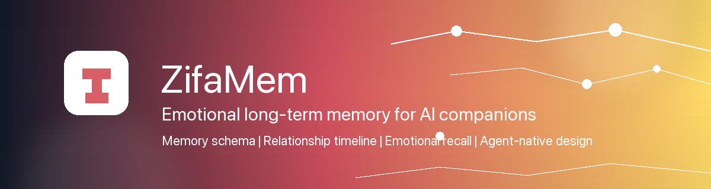

  

  <a href="../../README.md">English</a> |
  <a href="zh-CN.md">简体中文</a> |
  <a href="ja.md">日本語</a> |
  <a href="ru.md">Русский</a> |
  <a href="ko.md">한국어</a> |
  <a href="es.md">Español</a> |
  <a href="pt.md">Português</a>

  <strong>Memoria emocional a largo plazo para que los compañeros de IA crezcan, se adapten y recuerden lo que importa con el tiempo.</strong>

  <a href="#overview">Resumen</a>
  ·
  <a href="#features">Funciones</a>
  ·
  <a href="#why-zifamem">Por qué</a>
  ·
  <a href="#how-it-evolves">Evolución</a>
  ·
  <a href="#use-cases">Casos de uso</a>
  ·
  <a href="#planned-features">Roadmap</a>
  ·
  <a href="#project-status">Estado</a>

  
  
  
  

> El código fuente, la documentación y los ejemplos están en preparación. La versión open source llegará pronto.

## Resumen

ZifaMem es un framework de memoria emocional a largo plazo para agentes de IA, compañeros de IA y productos centrados en relaciones.

La mayoría de los sistemas de memoria ayudan a un agente a recuperar hechos. ZifaMem está diseñado para ayudar a un agente a **crecer**: los recuerdos pueden reforzarse, debilitarse, fusionarse, revisarse y olvidarse a medida que la relación cambia. El objetivo no es acumular una transcripción infinita, sino crear una capa de memoria viva que permita que un compañero de IA sea más consistente, más personal y más consciente del contexto emocional con el tiempo.

## Funciones

- Modelado de memoria emocional para ánimo, sentimiento, intensidad, confianza, comodidad, conflicto, apego y límites
- Timeline de relación para continuidad de largo plazo entre usuario y agente
- Políticas de ciclo de vida para refuerzo, decaimiento, fusión, reflexión y olvido
- Recall con conciencia emocional que equilibra relevancia semántica y contexto de relación
- Interfaces nativas para agentes: extracción, almacenamiento, recuperación, reflexión y generación de respuestas
- Controles visibles para el usuario, planificados para revisión, corrección, eliminación y personalización basada en consentimiento

## ¿Para quién es ZifaMem?

ZifaMem es para equipos que construyen productos de IA donde el agente debe sentirse como si estuviera aprendiendo la relación, no solo buscando en una base de datos.

ZifaMem encaja bien si:

- Construyes compañeros de IA, personajes, coaches o agentes de apoyo emocional
- Necesitas recuerdos que cambien cuando se construye confianza, se repara un conflicto o se repiten patrones
- Quieres agentes más personales sin guardar cada conversación para siempre
- Te importa la continuidad emocional, el consentimiento, el control del usuario y la seguridad a largo plazo
- Necesitas una capa de memoria que soporte reflexión y crecimiento del agente durante meses o años

ZifaMem puede no ser la mejor opción si solo necesitas historial de chat de corto plazo, búsqueda documental o recall factual orientado a tareas.

## Por qué ZifaMem

La mayoría de los sistemas de memoria de IA están optimizados para recall factual: nombres, preferencias, documentos, tareas y fragmentos recuperados.

ZifaMem está diseñado para otra capa de memoria: **continuidad emocional**.

Para compañeros de IA y productos centrados en relaciones, la memoria necesita preservar no solo lo que ocurrió, sino también cómo se sintió, por qué importó y cómo evolucionó la relación con el tiempo. ZifaMem está pensado para sistemas que necesitan recordar confianza, comodidad, conflicto, apego, límites, reparación, patrones emocionales recurrentes e historia compartida significativa.

## Qué lo hace diferente

| Memoria estática | ZifaMem |
| --- | --- |
| Guarda hechos y fragmentos | Modela recuerdos emocionalmente significativos |
| Optimiza similitud semántica | Equilibra relevancia, recencia, intensidad y contexto de relación |
| Trata la memoria como texto estático | Permite que los recuerdos se fortalezcan, se desvanezcan, se fusionen y se olviden |
| Recuerda lo que dijo el usuario | Recuerda lo que importó y cómo moldeó la relación |
| Personaliza desde preferencias aisladas | Personaliza desde un timeline de relación en evolución |
| Funciona bien para agentes de tareas | Diseñado para compañeros, roleplay, coaching y social AI |

## ¿Cuándo deberías usar ZifaMem?

Usa ZifaMem cuando el cuello de botella ya no sea la recuperación básica, sino la **continuidad**:

- Agentes de largo plazo que necesitan recordar historia emocional entre sesiones
- Productos de compañeros donde importan la confianza, vulnerabilidad, comodidad y conflicto
- Agentes de roleplay o personajes que necesitan una historia compartida estable
- Herramientas de coaching y reflexión que deben notar patrones emocionales recurrentes
- Sistemas de social AI que necesitan políticas de consentimiento, decaimiento y corrección
- Agentes que deben mejorar sus respuestas a medida que madura la relación con el usuario

## Cómo evoluciona

ZifaMem trata la memoria como un ciclo de vida, no como una pila de mensajes guardados.

```mermaid
flowchart LR
    CHAT["Conversación"] --> EXTRACT["Extraer señales"]
    EXTRACT --> SCORE["Evaluar significado emocional"]
    SCORE --> STORE["Guardar memoria"]
    STORE --> RECALL["Recall contextual"]
    RECALL --> RESPOND["Respuesta del agente"]
    RESPOND --> FEEDBACK["Reacción del usuario"]
    FEEDBACK --> REFLECT["Reflexionar y consolidar"]
    REFLECT --> UPDATE["Reforzar, fusionar, decaer u olvidar"]
    UPDATE --> STORE

    STORE -.- M1["Historia compartida"]
    RECALL -.- M2["Contexto de relación"]
    REFLECT -.- M3["Crecimiento del agente"]
    UPDATE -.- M4["Memoria viva"]

    style CHAT fill:#f6d365,stroke:#d97706,stroke-width:2px,color:#111827
    style EXTRACT fill:#f9a8d4,stroke:#be185d,stroke-width:2px,color:#111827
    style SCORE fill:#f472b6,stroke:#be185d,stroke-width:2px,color:#111827
    style STORE fill:#8b5cf6,stroke:#6d28d9,stroke-width:2px,color:#ffffff
    style RECALL fill:#6366f1,stroke:#4338ca,stroke-width:2px,color:#ffffff
    style RESPOND fill:#14b8a6,stroke:#0f766e,stroke-width:2px,color:#ffffff
    style FEEDBACK fill:#f97316,stroke:#c2410c,stroke-width:2px,color:#ffffff
    style REFLECT fill:#dc5f66,stroke:#b91c1c,stroke-width:2px,color:#ffffff
    style UPDATE fill:#111827,stroke:#374151,stroke-width:2px,color:#ffffff
    style M1 fill:#ffffff,stroke:#8b5cf6,stroke-width:1px,color:#6d28d9
    style M2 fill:#ffffff,stroke:#6366f1,stroke-width:1px,color:#4338ca
    style M3 fill:#ffffff,stroke:#dc5f66,stroke-width:1px,color:#b91c1c
    style M4 fill:#ffffff,stroke:#111827,stroke-width:1px,color:#111827
```

## Conceptos clave

### Memoria emocional

Los recuerdos pueden llevar señales emocionales como ánimo, sentimiento, intensidad, comodidad, vulnerabilidad, conflicto, confianza y relevancia de apego.

### Timeline de relación

ZifaMem organiza los recuerdos alrededor de la relación en evolución entre el usuario y el sistema de IA, no solo alrededor de fragmentos aislados de conversación.

### Ciclo de vida de la memoria

Los recuerdos pueden crearse, reforzarse, debilitarse, actualizarse, fusionarse u olvidarse. El objetivo es una memoria que evoluciona en lugar de acumular contexto obsoleto para siempre.

### Crecimiento del agente

El agente puede usar reflexión de memoria para alinearse mejor con los patrones emocionales del usuario, la historia de la relación y las formas de apoyo preferidas.

### Recall contextual

El recall está diseñado para combinar significado semántico con relevancia emocional, tiempo, estado del usuario, estado de la relación e intención conversacional.

### Diseño nativo para agentes

ZifaMem está planeado como un framework amigable para agentes, con extracción, almacenamiento, recuperación, reflexión, personalización y generación de respuestas con conciencia emocional.

## Casos de uso

- Compañeros de IA
- Agentes de apoyo emocional
- Agentes de roleplay y personajes
- Asistentes personales de IA de largo plazo
- Herramientas de coaching y reflexión
- Productos de social AI
- Agentes comunitarios y de atención al cliente con conciencia emocional

## Funciones planificadas

- Schema de memoria emocional
- Extracción de memoria desde conversaciones
- Etiquetado de señales emocionales y de relación
- Abstracción de almacenamiento a largo plazo
- Modelado de timeline de relación
- Ranking de recuperación con conciencia emocional
- Consolidación y reflexión de memoria
- Bucle de crecimiento del agente para reforzar recuerdos útiles y corregir los obsoletos
- Políticas de olvido, decaimiento y refuerzo
- Visibilidad de memoria controlada por el usuario
- Edición y eliminación de memoria basadas en consentimiento
- Ejemplos SDK para agentes compañeros
- Herramientas de evaluación de continuidad de memoria

## Preguntas frecuentes

### ¿ZifaMem es una base de datos vectorial?

No. ZifaMem está planeado como un framework de memoria que puede trabajar con sistemas de almacenamiento y recuperación, pero su foco es el significado emocional, la política de ciclo de vida, la continuidad de la relación y el crecimiento del agente.

### ¿ZifaMem guarda cada conversación?

No. El objetivo es extraer recuerdos significativos y permitir que cambien con el tiempo. Algunos recuerdos deben reforzarse, otros corregirse y otros desvanecerse u olvidarse.

### ¿En qué se diferencia de la personalización común?

La personalización común suele guardar preferencias. ZifaMem está diseñado para contexto relacional: confianza, comodidad, conflicto, vulnerabilidad, apego, límites, reparación e historia compartida.

### ¿Pueden los usuarios controlar la memoria?

La revisión, corrección, eliminación y controles basados en consentimiento visibles para el usuario forman parte del roadmap planificado.

## Estado del proyecto

ZifaMem está en desarrollo temprano.

Este repositorio público es una vista previa de la dirección del proyecto. La implementación, documentación, ejemplos, guía de contribución y licencia se publicarán pronto.

## Sigue el proyecto

Haz Watch a este repositorio para seguir la publicación open source.

Para actualizaciones de la organización, visita [Zifa AI](https://github.com/zifacorp).

## Licencia

Se anunciará junto con la publicación del código fuente.
