<p align="center">
  
</p>

<p align="center">
  <a href="../../README.md">English</a> |
  <a href="zh-CN.md">简体中文</a> |
  <a href="ja.md">日本語</a> |
  <a href="ru.md">Русский</a> |
  <a href="ko.md">한국어</a> |
  <a href="es.md">Español</a> |
  <a href="pt.md">Português</a>
</p>

<p align="center">
  <strong>Memoria emocional a largo plazo para que los compañeros de IA crezcan, se adapten y recuerden lo que importa con el tiempo.</strong>
</p>

<p align="center">
  <a href="#overview">Resumen</a>
  ·
  <a href="#quick-install">Instalación rápida</a>
  ·
  <a href="#implementation-status">Estado de implementación</a>
  ·
  <a href="#features">Funciones</a>
  ·
  <a href="#agent-skills">Agent Skills</a>
  ·
  <a href="#why-zifamem">Por qué</a>
  ·
  <a href="#how-it-evolves">Evolución</a>
  ·
  <a href="#use-cases">Casos de uso</a>
  ·
  <a href="#planned-features">Roadmap</a>
  ·
  <a href="#project-status">Estado</a>
</p>

<p align="center">
  
  
  
  
</p>

> ZifaMem ya está disponible como alpha Python SDK. La versión actual se enfoca en un ciclo de vida de memoria sin dependencias obligatorias, extracción opcional con LLMProvider, almacenamiento JSON local, armado de contexto para prompts y tests. Las integraciones de base de datos de producción y vectores están planificadas.

<a id="overview"></a>
## Resumen

ZifaMem es un framework de memoria emocional a largo plazo para agentes de IA, compañeros de IA y productos centrados en relaciones.

La mayoría de los sistemas de memoria ayudan a un agente a recuperar hechos. ZifaMem está diseñado para ayudar a un agente a **crecer**: los recuerdos pueden reforzarse, debilitarse, fusionarse, revisarse y olvidarse a medida que la relación cambia. El objetivo no es acumular una transcripción infinita, sino crear una capa de memoria viva que permita que un compañero de IA sea más consistente, más personal y más consciente del contexto emocional con el tiempo.

La alpha actual implementa la base de esa dirección. El growth loop completo sigue en construcción.

<a id="implementation-status"></a>
## Estado de implementación

Implementado en el alpha SDK:

- ✅ Buffer de sesión L1 mediante `record_turn`
- ✅ Resúmenes de sesión L2 mediante `end_session`
- ✅ Registros de memoria L3 a largo plazo con categoría, importancia, fuerza, evidencia y señales emocionales
- ✅ Actualizaciones del perfil L4 desde recuerdos seleccionados de identidad, preferencias, límites, conflicto, vulnerabilidad y momentos significativos
- ✅ Extracción heuristic sin dependencias desde turnos de usuario memory-eligible
- ✅ Extracción opcional con `LLMProvider`, validación JSON, filtro de evidencia de usuario y fallback heuristic
- ✅ Armado de contexto memory-ready para prompts mediante `get_context`
- ✅ `InMemoryStore` y `JsonMemoryStore` locales
- ✅ APIs manuales `remember`, `reinforce`, `weaken` y `forget`
- ✅ Ranking de recall que combina solapamiento semántico léxico, fuerza de memoria, importancia, decaimiento temporal e intensidad emocional
- ✅ Agent Skills portables para integración y revisión de seguridad de memoria

TODO:

- [ ] Fusión y actualización automáticas de recuerdos relacionados; hoy solo hay manejo conservador de duplicados
- [ ] Reflection loops que revisen o consoliden recuerdos periódicamente
- [ ] Visualización de timeline de relación y modelado más rico de estado relacional
- [ ] Adaptadores de base de datos de producción, vector-store y hosted services
- [ ] UI visible para revisión, corrección, consentimiento y eliminación de memoria
- [ ] Recuperación más fuerte que incorpore explícitamente estado del usuario, estado de relación e intención conversacional
- [ ] Agent growth loop que aprenda de feedback del usuario y corrija recuerdos obsoletos
- [ ] Herramientas de evaluación de continuidad de memoria a largo plazo

<a id="quick-install"></a>
## Instalación rápida

```bash
python -m pip install -e .
python -m zifamem demo
```

Para desarrollo:

```bash
python -m pip install -e ".[dev]"
python -m pytest
```

El motor por defecto sigue un flujo de borde de sesión: los turnos recientes se guardan como L1, las sesiones completadas se convierten en resúmenes L2, los hechos importantes del usuario suben a memorias emocionales L3 de largo plazo, y algunas memorias actualizan el perfil L4 del usuario.

### Extracción LLM opcional

ZifaMem no requiere LLM por defecto. Si quieres resúmenes de sesión y extracción de memoria respaldados por modelo, inyecta un provider:

```python
import os

from zifamem import LLMMemoryExtractor, OpenAICompatibleProvider, ZifaMemory

provider = OpenAICompatibleProvider(
    api_key=os.environ["OPENAI_API_KEY"],
    model="gpt-4.1-mini",
)

memory = ZifaMemory(extractor=LLMMemoryExtractor(provider))
```

`OpenAICompatibleProvider` usa el patrón Chat Completions JSON object y también puede apuntar a gateways locales o hosted compatibles mediante `base_url`. El extractor LLM valida categorías, puntuaciones y evidencia de hechos de usuario antes de escribir memorias de largo plazo, y hace fallback al extractor heuristic sin dependencias cuando falla el provider.

<a id="agent-skills"></a>
## Agent Skills

Este repositorio también publica Agent Skills portables para coding agents y agent harnesses:

- `skills/zifamem-integrate`: agregar ZifaMem a un compañero de IA, chatbot, agente de roleplay o coding-agent harness.
- `skills/zifamem-memory-audit`: revisar un flujo de memoria por seguridad de extracción, evidencia de hechos de usuario, validación de salida LLM y riesgo de filtración en publicación.

Los skills usan el patrón portable de carpeta `SKILL.md`. Se pueden copiar a herramientas que soporten Agent Skills:

```bash
# Codex personal skills
mkdir -p ~/.codex/skills
cp -R skills/zifamem-* ~/.codex/skills/

# Claude Code personal skills
mkdir -p ~/.claude/skills
cp -R skills/zifamem-* ~/.claude/skills/
```

Para OpenClaw u otros runtimes compatibles con `SKILL.md`, copia las mismas carpetas al directorio de skills configurado por la herramienta. Estos skills son guía procedural segura para publicación; la memoria persistente aún requiere integrar el SDK de ZifaMem en el runtime de la aplicación.

<a id="features"></a>
## Funciones

- Modelado de memoria emocional para ánimo, sentimiento, intensidad, confianza, comodidad, conflicto, apego y límites
- Primitivas de memoria relacional para continuidad de largo plazo entre usuario y agente
- APIs de ciclo de vida para refuerzo, recall con decaimiento y olvido; los loops de fusión y reflexión están planificados
- Prototipo de recall emocional que combina relevancia semántica léxica, recencia, importancia, fuerza e intensidad emocional
- Interfaces nativas para agentes: extracción, almacenamiento, recuperación, consolidación de sesión y armado de prompt context
- Interfaz LLMProvider opcional y adaptador extractor OpenAI-compatible
- Agent Skills portables para integración y revisión de seguridad de memoria
- Stores locales en memoria y JSON para desarrollo, tests y despliegues pequeños
- APIs de eliminación, debilitamiento y refuerzo de memoria; la UI visible de revisión de memoria está planificada

## ¿Para quién es ZifaMem?

ZifaMem es para equipos que construyen productos de IA donde el agente debe sentirse como si estuviera aprendiendo la relación, no solo buscando en una base de datos.

ZifaMem encaja bien si:

- Construyes compañeros de IA, personajes, coaches o agentes de apoyo emocional
- Necesitas recuerdos que cambien cuando se construye confianza, se repara un conflicto o se repiten patrones
- Quieres agentes más personales sin guardar cada conversación para siempre
- Te importa la continuidad emocional, el consentimiento, el control del usuario y la seguridad a largo plazo
- Necesitas una capa de memoria que soporte reflexión y crecimiento del agente durante meses o años

ZifaMem puede no ser la mejor opción si solo necesitas historial de chat de corto plazo, búsqueda documental o recall factual orientado a tareas.

<a id="why-zifamem"></a>
## Por qué ZifaMem

La mayoría de los sistemas de memoria de IA están optimizados para recall factual: nombres, preferencias, documentos, tareas y fragmentos recuperados.

ZifaMem está diseñado para otra capa de memoria: **continuidad emocional**.

Para compañeros de IA y productos centrados en relaciones, la memoria necesita preservar no solo lo que ocurrió, sino también cómo se sintió, por qué importó y cómo evolucionó la relación con el tiempo. ZifaMem está pensado para sistemas que necesitan recordar confianza, comodidad, conflicto, apego, límites, reparación, patrones emocionales recurrentes e historia compartida significativa.

## Qué lo hace diferente

| Memoria estática | ZifaMem |
| --- | --- |
| Guarda hechos y fragmentos | Modela recuerdos emocionalmente significativos |
| Optimiza similitud semántica | Equilibra relevancia, recencia, intensidad y contexto de relación |
| Trata la memoria como texto estático | Permite que los recuerdos se fortalezcan, se desvanezcan, se fusionen y se olviden |
| Recuerda lo que dijo el usuario | Recuerda lo que importó y cómo moldeó la relación |
| Personaliza desde preferencias aisladas | Personaliza desde un timeline de relación en evolución |
| Funciona bien para agentes de tareas | Diseñado para compañeros, roleplay, coaching y social AI |

## ¿Cuándo deberías usar ZifaMem?

Usa ZifaMem cuando el cuello de botella ya no sea la recuperación básica, sino la **continuidad**:

- Agentes de largo plazo que necesitan recordar historia emocional entre sesiones
- Productos de compañeros donde importan la confianza, vulnerabilidad, comodidad y conflicto
- Agentes de roleplay o personajes que necesitan una historia compartida estable
- Herramientas de coaching y reflexión que deben notar patrones emocionales recurrentes
- Sistemas de social AI que necesitan políticas de consentimiento, decaimiento y corrección
- Agentes que deben mejorar sus respuestas a medida que madura la relación con el usuario

<a id="how-it-evolves"></a>
## Cómo evoluciona

ZifaMem trata la memoria como un ciclo de vida, no como una pila de mensajes guardados.

```mermaid
flowchart LR
    CHAT["Conversación"] --> EXTRACT["Extraer señales"]
    EXTRACT --> SCORE["Evaluar significado emocional"]
    SCORE --> STORE["Guardar memoria"]
    STORE --> RECALL["Recall contextual"]
    RECALL --> RESPOND["Respuesta del agente"]
    RESPOND --> FEEDBACK["Reacción del usuario"]
    FEEDBACK --> REFLECT["Reflexionar y consolidar"]
    REFLECT --> UPDATE["Reforzar, fusionar, decaer u olvidar"]
    UPDATE --> STORE

    STORE -.- M1["Historia compartida"]
    RECALL -.- M2["Contexto de relación"]
    REFLECT -.- M3["Crecimiento del agente"]
    UPDATE -.- M4["Memoria viva"]

    style CHAT fill:#f6d365,stroke:#d97706,stroke-width:2px,color:#111827
    style EXTRACT fill:#f9a8d4,stroke:#be185d,stroke-width:2px,color:#111827
    style SCORE fill:#f472b6,stroke:#be185d,stroke-width:2px,color:#111827
    style STORE fill:#8b5cf6,stroke:#6d28d9,stroke-width:2px,color:#ffffff
    style RECALL fill:#6366f1,stroke:#4338ca,stroke-width:2px,color:#ffffff
    style RESPOND fill:#14b8a6,stroke:#0f766e,stroke-width:2px,color:#ffffff
    style FEEDBACK fill:#f97316,stroke:#c2410c,stroke-width:2px,color:#ffffff
    style REFLECT fill:#dc5f66,stroke:#b91c1c,stroke-width:2px,color:#ffffff
    style UPDATE fill:#111827,stroke:#374151,stroke-width:2px,color:#ffffff
    style M1 fill:#ffffff,stroke:#8b5cf6,stroke-width:1px,color:#6d28d9
    style M2 fill:#ffffff,stroke:#6366f1,stroke-width:1px,color:#4338ca
    style M3 fill:#ffffff,stroke:#dc5f66,stroke-width:1px,color:#b91c1c
    style M4 fill:#ffffff,stroke:#111827,stroke-width:1px,color:#111827
```



## Conceptos clave

### Memoria emocional

Los recuerdos pueden llevar señales emocionales como ánimo, sentimiento, intensidad, comodidad, vulnerabilidad, conflicto, confianza y relevancia de apego.

### Timeline de relación

ZifaMem organiza los recuerdos alrededor de la relación en evolución entre el usuario y el sistema de IA, no solo alrededor de fragmentos aislados de conversación.

### Ciclo de vida de la memoria

Los recuerdos pueden crearse, reforzarse, debilitarse, actualizarse, fusionarse u olvidarse. El objetivo es una memoria que evoluciona en lugar de acumular contexto obsoleto para siempre.

### Crecimiento del agente

El agente puede usar reflexión de memoria para alinearse mejor con los patrones emocionales del usuario, la historia de la relación y las formas de apoyo preferidas.

### Recall contextual

El recall está diseñado para combinar significado semántico con relevancia emocional, tiempo, estado del usuario, estado de la relación e intención conversacional.

### Diseño nativo para agentes

ZifaMem está planeado como un framework amigable para agentes, con extracción, almacenamiento, recuperación, reflexión, personalización y generación de respuestas con conciencia emocional.

<a id="use-cases"></a>
## Casos de uso

- Compañeros de IA
- Agentes de apoyo emocional
- Agentes de roleplay y personajes
- Asistentes personales de IA de largo plazo
- Herramientas de coaching y reflexión
- Productos de social AI
- Agentes comunitarios y de atención al cliente con conciencia emocional

<a id="planned-features"></a>
## Funciones planificadas

- Schema de memoria emocional
- Extracción de memoria desde conversaciones
- Etiquetado de señales emocionales y de relación
- Adaptadores de base de datos de producción y vector-store
- Fusión, actualización y reflection loops automáticos de memoria
- Más ejemplos de reflexión LLM-backed y providers
- Visualización de timeline de relación
- Ranking de recuperación emocional más rico
- Bucle de crecimiento del agente para reforzar recuerdos útiles y corregir los obsoletos
- Visibilidad de memoria controlada por el usuario
- Edición y eliminación de memoria basadas en consentimiento
- Más ejemplos SDK para agentes compañeros
- Herramientas de evaluación de continuidad de memoria

## Preguntas frecuentes

### ¿ZifaMem es una base de datos vectorial?

No. ZifaMem está planeado como un framework de memoria que puede trabajar con sistemas de almacenamiento y recuperación, pero su foco es el significado emocional, la política de ciclo de vida, la continuidad de la relación y el crecimiento del agente.

### ¿ZifaMem guarda cada conversación?

No. El objetivo es extraer recuerdos significativos y permitir que cambien con el tiempo. Algunos recuerdos deben reforzarse, otros corregirse y otros desvanecerse u olvidarse.

### ¿En qué se diferencia de la personalización común?

La personalización común suele guardar preferencias. ZifaMem está diseñado para contexto relacional: confianza, comodidad, conflicto, vulnerabilidad, apego, límites, reparación e historia compartida.

### ¿Pueden los usuarios controlar la memoria?

La revisión, corrección, eliminación y controles basados en consentimiento visibles para el usuario forman parte del roadmap planificado.

<a id="project-status"></a>
## Estado del proyecto

ZifaMem está en alpha.

Este repositorio público ya incluye la primera implementación del Python SDK, adaptadores opcionales de extracción LLM, Agent Skills, ejemplos y unit tests. La implementación actual sigue siendo local-first y sin dependencias por defecto. Es adecuada para evaluación, prototipado y desarrollo de adaptadores; el almacenamiento de producción, la búsqueda vectorial, los hosted services y la licencia final siguen en preparación.

## Sigue el proyecto

Haz Watch a este repositorio para seguir la publicación open source.

Para actualizaciones de la organización, visita [Zifa AI](https://github.com/zifacorp).

## Licencia

Se anunciará junto con la publicación del código fuente.
