<p align="center">
  
</p>

<p align="center">
  <a href="../../README.md">English</a> |
  <a href="zh-CN.md">简体中文</a> |
  <a href="ja.md">日本語</a> |
  <a href="ru.md">Русский</a> |
  <a href="ko.md">한국어</a> |
  <a href="es.md">Español</a> |
  <a href="pt.md">Português</a>
</p>

<p align="center">
  <strong>AI コンパニオンが成長し、適応し、時間とともに大切なことを記憶するための感情的長期記憶。</strong>
</p>

<p align="center">
  <a href="#overview">概要</a>
  ·
  <a href="#quick-install">クイックインストール</a>
  ·
  <a href="#implementation-status">実装ステータス</a>
  ·
  <a href="#features">機能</a>
  ·
  <a href="#agent-skills">Agent Skills</a>
  ·
  <a href="#why-zifamem">なぜ ZifaMem か</a>
  ·
  <a href="#how-it-evolves">進化</a>
  ·
  <a href="#use-cases">ユースケース</a>
  ·
  <a href="#planned-features">ロードマップ</a>
  ·
  <a href="#project-status">ステータス</a>
</p>

<p align="center">
  
  
  
  
</p>

> ZifaMem は alpha 版 Python SDK として利用できます。現在のリリースは、デフォルトで外部依存のない記憶ライフサイクル、任意の LLMProvider 抽出、ローカル JSON ストレージ、prompt コンテキスト組み立て、テストに焦点を当てています。Production database と vector integration は計画中です。

<a id="overview"></a>
## 概要

ZifaMem は、AI エージェント、AI コンパニオン、関係性を中心にしたプロダクトのための感情的長期記憶フレームワークです。

多くの記憶システムは、エージェントが事実を検索するためのものです。ZifaMem は、エージェントが**成長**することを目的に設計されています。関係性の変化に応じて、記憶は強化され、弱まり、統合され、振り返られ、忘れられます。無限に会話ログをためるのではなく、AI コンパニオンが時間とともに一貫性を増し、より個人的で、感情的文脈を理解できるようにする生きた記憶レイヤーを目指します。

現在の alpha はこの方向性の土台を実装しています。完全な growth loop はまだ構築中です。

<a id="implementation-status"></a>
## 実装ステータス

alpha SDK で実装済み:

- ✅ `record_turn` による L1 セッションバッファ
- ✅ `end_session` による L2 セッションサマリー
- ✅ カテゴリ、重要度、強度、証拠、感情シグナルを持つ L3 長期記憶レコード
- ✅ 身元、好み、境界、衝突、脆弱性、意味のある出来事からの L4 ユーザープロファイル更新
- ✅ memory-eligible なユーザー発話からの依存なし heuristic 抽出
- ✅ JSON 検証、ユーザー証拠フィルタリング、heuristic fallback を備えた任意の `LLMProvider` 抽出
- ✅ `get_context` による prompt-ready な記憶コンテキスト組み立て
- ✅ ローカル `InMemoryStore` と `JsonMemoryStore`
- ✅ 手動 `remember`、`reinforce`、`weaken`、`forget` API
- ✅ 語彙的な意味重なり、記憶強度、重要度、時間減衰、感情強度を組み合わせた recall ranking
- ✅ 統合と記憶安全レビューのためのポータブル Agent Skills

TODO:

- [ ] 関連記憶の自動 merge / update。現在は保守的な重複処理のみ
- [ ] 記憶を定期的に修正・統合する reflection loop
- [ ] 関係タイムライン可視化とより豊かな関係状態モデリング
- [ ] Production database、vector-store、hosted-service adapters
- [ ] ユーザー可視の記憶確認、修正、同意、削除 UI
- [ ] ユーザー状態、関係状態、会話意図を明示的に取り込むより強い retrieval
- [ ] ユーザーフィードバックから学び、古い記憶を修正する agent growth loop
- [ ] 長期的な記憶連続性の評価ツール

<a id="quick-install"></a>
## クイックインストール

```bash
python -m pip install -e .
python -m zifamem demo
```

開発用:

```bash
python -m pip install -e ".[dev]"
python -m pytest
```

デフォルトエンジンはセッション境界の流れに従います。直近の発話を L1 に保持し、完了したセッションを L2 サマリーにし、重要なユーザー事実を L3 感情的長期記憶に昇格し、一部の記憶で L4 ユーザープロファイルを更新します。

### 任意の LLM 抽出

ZifaMem はデフォルトでは LLM を必要としません。モデルによるセッションサマリーと記憶抽出が必要な場合は provider を注入します。

```python
import os

from zifamem import LLMMemoryExtractor, OpenAICompatibleProvider, ZifaMemory

provider = OpenAICompatibleProvider(
    api_key=os.environ["OPENAI_API_KEY"],
    model="gpt-4.1-mini",
)

memory = ZifaMemory(extractor=LLMMemoryExtractor(provider))
```

`OpenAICompatibleProvider` は Chat Completions JSON object パターンを使い、`base_url` で互換性のあるローカルまたは hosted gateway にも接続できます。LLM extractor は長期記憶を書き込む前にカテゴリ、スコア、ユーザー事実の証拠を検証し、provider が失敗した場合は依存なし heuristic extractor に fallback します。

<a id="agent-skills"></a>
## Agent Skills

このリポジトリは coding agent と agent harness 向けのポータブル Agent Skills も公開しています。

- `skills/zifamem-integrate`: ZifaMem を AI コンパニオン、チャットボット、ロールプレイエージェント、coding-agent harness に追加します。
- `skills/zifamem-memory-audit`: 抽出安全性、ユーザー事実の証拠、LLM 出力検証、公開リリース時の漏えいリスクをレビューします。

これらの skill はポータブルな `SKILL.md` フォルダ形式です。Agent Skills をサポートするツールにコピーできます。

```bash
# Codex personal skills
mkdir -p ~/.codex/skills
cp -R skills/zifamem-* ~/.codex/skills/

# Claude Code personal skills
mkdir -p ~/.claude/skills
cp -R skills/zifamem-* ~/.claude/skills/
```

OpenClaw など `SKILL.md` 互換 runtime では、同じフォルダをそのツールの設定済み skills directory にコピーしてください。これらの skills は公開しても安全な手順ガイドです。永続的な記憶には、アプリケーション runtime で ZifaMem SDK を統合する必要があります。

<a id="features"></a>
## 機能

- 気分、感情傾向、強度、信頼、安心感、衝突、愛着、境界線などの感情記憶モデリング
- 長期的なユーザーとエージェントの連続性を支える関係記憶の基礎構造
- 強化、減衰を考慮した recall、忘却のための記憶ライフサイクル API。自動 merge と reflection loop は計画中
- 語彙的な意味関連性、時間、重要度、強度、感情強度を組み合わせる感情認識型 recall prototype
- 抽出、保存、検索、セッション統合、prompt コンテキスト組み立てのためのエージェントネイティブなインターフェース
- 任意の LLMProvider interface と OpenAI-compatible extractor adapter
- 統合と記憶安全レビューのためのポータブル Agent Skills
- 開発、テスト、小規模 deployment 向けの in-memory store と JSON store
- 記憶削除、弱化、強化 API。ユーザー可視の memory review UI は計画中

## ZifaMem は誰のためのものですか？

ZifaMem は、エージェントが単にデータベースを検索するのではなく、関係性を学んでいるように感じられる AI プロダクトを作るチームのためのものです。

ZifaMem は次のような場合に適しています。

- AI コンパニオン、キャラクター、コーチ、感情サポートエージェントを作っている
- 信頼の形成、衝突の修復、繰り返されるパターンに応じて記憶を変化させたい
- すべての会話を永久保存せずに、エージェントをより個人的にしたい
- 感情的連続性、同意、ユーザー制御、長期安全性を重視している
- 数か月から数年にわたる振り返りとエージェント成長を支える記憶レイヤーが必要

短期的なチャット履歴、文書検索、タスク向けの事実リコールだけが必要な場合、ZifaMem は最適ではないかもしれません。

<a id="why-zifamem"></a>
## なぜ ZifaMem か

多くの AI 記憶システムは、名前、好み、文書、タスク、検索された断片などの事実リコールに最適化されています。

ZifaMem は、別の層の記憶、つまり**感情的連続性**のために設計されています。

AI コンパニオンや関係性を中心にした AI では、何が起きたかだけでなく、それがどう感じられたか、なぜ重要だったか、関係が時間とともにどう変化したかを保持する必要があります。ZifaMem は、信頼、安心感、衝突、愛着、境界線、修復、繰り返される感情パターン、意味のある共有履歴を記憶する必要があるシステムのために作られています。

## 何が違うのか

| 静的な記憶 | ZifaMem |
| --- | --- |
| 事実と断片を保存する | 感情的に意味のある記憶をモデル化する |
| 意味的類似度を最適化する | 関連性、新しさ、強度、関係文脈をバランスする |
| 記憶を静的なテキストとして扱う | 記憶を強め、薄め、統合し、忘れられるようにする |
| ユーザーが言ったことを思い出す | 何が重要で、それが関係をどう形作ったかを思い出す |
| 孤立した好みからパーソナライズする | 進化する関係タイムラインからパーソナライズする |
| タスク型エージェントに向いている | コンパニオン、ロールプレイ、コーチング、ソーシャル AI のために設計されている |

## いつ ZifaMem を使うべきですか？

ボトルネックが基本的な検索ではなく**連続性**になったとき、ZifaMem が役立ちます。

- セッションをまたいで感情的履歴を覚える必要がある長期運用エージェント
- 信頼、弱さ、安心感、衝突が重要なコンパニオン製品
- 安定した共有履歴が必要なロールプレイやキャラクターエージェント
- 繰り返される感情パターンに気づく必要があるコーチングや振り返りツール
- 同意、減衰、修正のための記憶ポリシーが必要なソーシャル AI システム
- ユーザーとの関係が成熟するにつれて応答を改善すべきエージェント

<a id="how-it-evolves"></a>
## どのように進化するか

ZifaMem は記憶を、保存されたメッセージの山ではなくライフサイクルとして扱います。

```mermaid
flowchart LR
    CHAT["会話"] --> EXTRACT["信号を抽出"]
    EXTRACT --> SCORE["感情的意味を評価"]
    SCORE --> STORE["記憶を保存"]
    STORE --> RECALL["文脈リコール"]
    RECALL --> RESPOND["エージェント応答"]
    RESPOND --> FEEDBACK["ユーザー反応"]
    FEEDBACK --> REFLECT["振り返りと統合"]
    REFLECT --> UPDATE["強化、統合、減衰、忘却"]
    UPDATE --> STORE

    STORE -.- M1["共有履歴"]
    RECALL -.- M2["関係文脈"]
    REFLECT -.- M3["エージェント成長"]
    UPDATE -.- M4["生きた記憶"]

    style CHAT fill:#f6d365,stroke:#d97706,stroke-width:2px,color:#111827
    style EXTRACT fill:#f9a8d4,stroke:#be185d,stroke-width:2px,color:#111827
    style SCORE fill:#f472b6,stroke:#be185d,stroke-width:2px,color:#111827
    style STORE fill:#8b5cf6,stroke:#6d28d9,stroke-width:2px,color:#ffffff
    style RECALL fill:#6366f1,stroke:#4338ca,stroke-width:2px,color:#ffffff
    style RESPOND fill:#14b8a6,stroke:#0f766e,stroke-width:2px,color:#ffffff
    style FEEDBACK fill:#f97316,stroke:#c2410c,stroke-width:2px,color:#ffffff
    style REFLECT fill:#dc5f66,stroke:#b91c1c,stroke-width:2px,color:#ffffff
    style UPDATE fill:#111827,stroke:#374151,stroke-width:2px,color:#ffffff
    style M1 fill:#ffffff,stroke:#8b5cf6,stroke-width:1px,color:#6d28d9
    style M2 fill:#ffffff,stroke:#6366f1,stroke-width:1px,color:#4338ca
    style M3 fill:#ffffff,stroke:#dc5f66,stroke-width:1px,color:#b91c1c
    style M4 fill:#ffffff,stroke:#111827,stroke-width:1px,color:#111827
```



## 主要コンセプト

### 感情記憶

記憶は、気分、感情傾向、強度、安心感、弱さ、衝突、信頼、愛着関連性などの感情信号を持つことができます。

### 関係タイムライン

ZifaMem は、孤立した会話チャンクではなく、ユーザーと AI システムの間で進化する関係を中心に記憶を整理します。

### 記憶ライフサイクル

記憶は作成、強化、弱化、更新、統合、忘却されます。目的は、古い文脈を永遠に蓄積するのではなく、進化する記憶システムを作ることです。

### エージェント成長

エージェントは記憶の振り返りを使って、ユーザーの感情パターン、関係履歴、望ましい支援の形によりよく合わせることができます。

### 文脈リコール

リコールは、意味、感情的関連性、時間、ユーザー状態、関係状態、会話意図を組み合わせるように設計されています。

### エージェントネイティブ設計

ZifaMem は、抽出、保存、検索、振り返り、パーソナライズ、感情認識型応答生成のためのエージェント向けフレームワークとして計画されています。

<a id="use-cases"></a>
## ユースケース

- AI コンパニオン
- 感情サポートエージェント
- ロールプレイとキャラクターエージェント
- 長期運用の個人 AI アシスタント
- コーチングと振り返りツール
- ソーシャル AI 製品
- 感情認識型コミュニティおよびカスタマーエージェント

<a id="planned-features"></a>
## 計画中の機能

- 感情記憶スキーマ
- 会話から記憶への抽出
- 感情と関係信号のタグ付け
- Production database と vector-store adapters
- 自動的な記憶の merge、update、reflection loop
- より多くの LLM-backed reflection と provider examples
- 関係タイムライン可視化
- より豊かな感情認識型 retrieval ranking
- 有用な記憶を強化し古い記憶を修正するエージェント成長ループ
- ユーザーが制御できる記憶の可視性
- 同意に基づく記憶編集と削除
- コンパニオンエージェント向けのより多くの SDK サンプル
- 記憶連続性の評価ツール

## よくある質問

### ZifaMem はベクトルデータベースですか？

いいえ。ZifaMem は保存や検索システムと連携できる記憶フレームワークとして計画されていますが、焦点は感情的意味、ライフサイクルポリシー、関係の連続性、エージェント成長です。

### ZifaMem はすべての会話を保存しますか？

いいえ。目的は意味のある記憶を抽出し、それらを時間とともに変化させることです。一部の記憶は強化され、一部は修正され、一部は薄れたり忘れられたりするべきです。

### 通常のパーソナライズと何が違いますか？

通常のパーソナライズは好みを保存することが多いです。ZifaMem は、信頼、安心感、衝突、弱さ、愛着、境界線、修復、共有履歴といった関係性の文脈のために設計されています。

### ユーザーは記憶を制御できますか？

記憶の確認、修正、削除、同意に基づく制御は計画中のロードマップに含まれています。

<a id="project-status"></a>
## プロジェクトステータス

ZifaMem は alpha 段階です。

この公開リポジトリには、最初の Python SDK 実装、任意の LLM extraction adapters、Agent Skills、サンプル、ユニットテストが含まれています。現在の実装はデフォルトで local-first かつ依存なしです。評価、プロトタイピング、adapter development に適しています。Production storage、vector search、hosted services、最終ライセンスは準備中です。

## フォロー

オープンソース公開を追うには、このリポジトリを Watch してください。

組織の更新情報は [Zifa AI](https://github.com/zifacorp) をご覧ください。

## ライセンス

ソースコード公開時に発表予定です。
