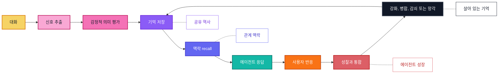

<p align="center">
  
</p>

<p align="center">
  <a href="../../README.md">English</a> |
  <a href="zh-CN.md">简体中文</a> |
  <a href="ja.md">日本語</a> |
  <a href="ru.md">Русский</a> |
  <a href="ko.md">한국어</a> |
  <a href="es.md">Español</a> |
  <a href="pt.md">Português</a>
</p>

<p align="center">
  <strong>AI 컴패니언이 시간이 지날수록 성장하고 적응하며 중요한 것을 기억하도록 돕는 감정 장기 기억.</strong>
</p>

<p align="center">
  <a href="#overview">개요</a>
  ·
  <a href="#quick-install">빠른 설치</a>
  ·
  <a href="#implementation-status">구현 상태</a>
  ·
  <a href="#features">기능</a>
  ·
  <a href="#agent-skills">Agent Skills</a>
  ·
  <a href="#why-zifamem">왜 ZifaMem인가</a>
  ·
  <a href="#how-it-evolves">진화</a>
  ·
  <a href="#use-cases">사용 사례</a>
  ·
  <a href="#planned-features">로드맵</a>
  ·
  <a href="#project-status">상태</a>
</p>

<p align="center">
  
  
  
  
</p>

> ZifaMem은 이제 alpha Python SDK로 사용할 수 있습니다. 현재 릴리스는 기본적으로 외부 의존성이 없는 기억 생애주기, 선택적 LLMProvider 추출, 로컬 JSON 저장소, prompt 컨텍스트 조립, 테스트에 초점을 둡니다. 프로덕션 데이터베이스와 벡터 통합은 계획 중입니다.

<a id="overview"></a>
## 개요

ZifaMem은 AI 에이전트, AI 컴패니언, 관계 중심 제품을 위한 감정 장기 기억 프레임워크입니다.

대부분의 기억 시스템은 에이전트가 사실을 검색하도록 돕습니다. ZifaMem은 에이전트가 **성장**하도록 설계되었습니다. 관계가 변함에 따라 기억은 강화되고, 약해지고, 병합되고, 성찰되고, 잊힐 수 있습니다. 목표는 대화 기록을 끝없이 쌓는 것이 아니라 AI 컴패니언이 시간이 지날수록 더 일관되고, 더 개인화되며, 감정 맥락을 더 잘 이해하도록 돕는 살아 있는 기억 계층을 만드는 것입니다.

현재 alpha는 이 방향의 기반을 구현합니다. 완전한 growth loop는 아직 구축 중입니다.

<a id="implementation-status"></a>
## 구현 상태

alpha SDK에서 구현됨:

- ✅ `record_turn`을 통한 L1 세션 버퍼
- ✅ `end_session`을 통한 L2 세션 요약
- ✅ 카테고리, 중요도, 강도, 증거, 감정 신호를 포함한 L3 장기 기억 레코드
- ✅ 신원, 선호, 경계, 갈등, 취약성, 의미 있는 순간 기억에서 L4 사용자 프로필 업데이트
- ✅ memory-eligible 사용자 턴에서 동작하는 의존성 없는 heuristic 추출
- ✅ JSON 검증, 사용자 증거 필터링, heuristic fallback을 포함한 선택적 `LLMProvider` 추출
- ✅ `get_context`를 통한 prompt-ready 기억 컨텍스트 조립
- ✅ 로컬 `InMemoryStore`와 `JsonMemoryStore`
- ✅ 수동 `remember`, `reinforce`, `weaken`, `forget` API
- ✅ 어휘적 의미 중첩, 기억 강도, 중요도, 시간 감쇠, 감정 강도를 결합한 recall ranking
- ✅ 통합과 기억 안전 리뷰를 위한 portable Agent Skills

TODO:

- [ ] 관련 기억의 자동 merge / update. 현재는 보수적인 중복 처리만 제공
- [ ] 기억을 주기적으로 수정하거나 통합하는 reflection loop
- [ ] 관계 타임라인 시각화와 더 풍부한 관계 상태 모델링
- [ ] 프로덕션 데이터베이스, vector-store, hosted-service adapters
- [ ] 사용자가 볼 수 있는 기억 검토, 수정, 동의, 삭제 UI
- [ ] 사용자 상태, 관계 상태, 대화 의도를 명시적으로 반영하는 더 강한 retrieval
- [ ] 사용자 피드백에서 학습하고 오래된 기억을 수정하는 agent growth loop
- [ ] 장기 기억 연속성 평가 도구

<a id="quick-install"></a>
## 빠른 설치

```bash
python -m pip install -e .
python -m zifamem demo
```

개발용:

```bash
python -m pip install -e ".[dev]"
python -m pytest
```

기본 엔진은 세션 경계 흐름을 따릅니다. 최근 턴은 L1에 버퍼링되고, 완료된 세션은 L2 요약이 되며, 중요한 사용자 사실은 L3 감정 장기 기억으로 승격되고, 선택된 기억은 L4 사용자 프로필을 업데이트합니다.

### 선택적 LLM 추출

ZifaMem은 기본적으로 LLM이 필요하지 않습니다. 모델 기반 세션 요약과 기억 추출이 필요하면 provider를 주입하세요.

```python
import os

from zifamem import LLMMemoryExtractor, OpenAICompatibleProvider, ZifaMemory

provider = OpenAICompatibleProvider(
    api_key=os.environ["OPENAI_API_KEY"],
    model="gpt-4.1-mini",
)

memory = ZifaMemory(extractor=LLMMemoryExtractor(provider))
```

`OpenAICompatibleProvider`는 Chat Completions JSON object 패턴을 사용하며 `base_url`로 호환 가능한 로컬 또는 hosted gateway를 가리킬 수 있습니다. LLM extractor는 장기 기억을 쓰기 전에 카테고리, 점수, 사용자 사실 증거를 검증하고 provider 실패 시 의존성 없는 heuristic extractor로 fallback합니다.

<a id="agent-skills"></a>
## Agent Skills

이 저장소는 coding agent와 agent harness를 위한 portable Agent Skills도 제공합니다.

- `skills/zifamem-integrate`: ZifaMem을 AI 컴패니언, 챗봇, 롤플레이 에이전트 또는 coding-agent harness에 추가합니다.
- `skills/zifamem-memory-audit`: 추출 안전성, 사용자 사실 증거, LLM 출력 검증, 공개 릴리스 누출 위험을 리뷰합니다.

이 skills는 portable `SKILL.md` 폴더 패턴을 사용합니다. Agent Skills를 지원하는 도구에 복사할 수 있습니다.

```bash
# Codex personal skills
mkdir -p ~/.codex/skills
cp -R skills/zifamem-* ~/.codex/skills/

# Claude Code personal skills
mkdir -p ~/.claude/skills
cp -R skills/zifamem-* ~/.claude/skills/
```

OpenClaw 또는 다른 `SKILL.md` 호환 runtime에서는 같은 폴더를 해당 도구가 설정한 skills 디렉터리에 복사하세요. 이 skills는 공개해도 안전한 절차 가이드입니다. 지속 기억에는 애플리케이션 runtime에서 ZifaMem SDK를 통합해야 합니다.

<a id="features"></a>
## 기능

- 기분, 감정, 강도, 신뢰, 편안함, 갈등, 애착, 경계에 대한 감정 기억 모델링
- 장기적인 사용자-에이전트 연속성을 위한 관계 기억 기반 구조
- 강화, 감쇠 인식 recall, 망각을 위한 기억 생애주기 API. 자동 merge와 reflection loop는 계획 중
- 어휘적 의미 관련성, 시간, 중요도, 강도, 감정 강도를 결합한 감정 인식형 recall prototype
- 추출, 저장, 검색, 세션 통합, prompt 컨텍스트 조립을 위한 에이전트 네이티브 인터페이스
- 선택적 LLMProvider interface와 OpenAI-compatible extractor adapter
- 통합과 기억 안전 리뷰를 위한 portable Agent Skills
- 개발, 테스트, 소규모 배포를 위한 in-memory store와 JSON store
- 기억 삭제, 약화, 강화 API. 사용자 가시적 memory review UI는 계획 중

## ZifaMem은 누구를 위한 것인가요?

ZifaMem은 에이전트가 단순히 데이터베이스를 검색하는 것이 아니라 관계를 배우는 것처럼 느껴지는 AI 제품을 만드는 팀을 위한 것입니다.

ZifaMem은 다음과 같은 경우에 잘 맞습니다.

- AI 컴패니언, 캐릭터, 코치, 감정 지원 에이전트를 만드는 경우
- 신뢰 형성, 갈등 회복, 반복 패턴에 따라 기억이 변해야 하는 경우
- 모든 대화를 영구 저장하지 않고도 에이전트를 더 개인화하고 싶은 경우
- 감정적 연속성, 동의, 사용자 제어, 장기 안전성을 중요하게 여기는 경우
- 수개월 또는 수년에 걸친 성찰과 에이전트 성장을 지원하는 기억 계층이 필요한 경우

단기 채팅 기록, 문서 검색, 작업 중심의 사실 recall만 필요하다면 ZifaMem은 최적의 선택이 아닐 수 있습니다.

<a id="why-zifamem"></a>
## 왜 ZifaMem인가

대부분의 AI 기억 시스템은 이름, 선호도, 문서, 작업, 검색된 조각 같은 사실 recall에 최적화되어 있습니다.

ZifaMem은 다른 층의 기억, 즉 **감정적 연속성**을 위해 설계되었습니다.

AI 컴패니언과 관계 중심 AI에서는 무엇이 일어났는지뿐 아니라 그것이 어떻게 느껴졌는지, 왜 중요했는지, 관계가 시간이 지나며 어떻게 변화했는지도 보존해야 합니다. ZifaMem은 신뢰, 편안함, 갈등, 애착, 경계, 회복, 반복되는 감정 패턴, 의미 있는 공유 역사를 기억해야 하는 시스템을 위해 만들어졌습니다.

## 무엇이 다른가요?

| 정적인 기억 | ZifaMem |
| --- | --- |
| 사실과 조각을 저장함 | 감정적으로 의미 있는 기억을 모델링함 |
| 의미적 유사도를 최적화함 | 관련성, 최신성, 강도, 관계 맥락을 균형 있게 고려함 |
| 기억을 정적인 텍스트로 다룸 | 기억이 강화되고, 희미해지고, 병합되고, 잊힐 수 있게 함 |
| 사용자가 말한 것을 떠올림 | 무엇이 중요했는지와 그것이 관계를 어떻게 형성했는지 떠올림 |
| 분리된 선호도에서 개인화함 | 진화하는 관계 타임라인에서 개인화함 |
| 작업형 에이전트에 잘 맞음 | 컴패니언, 롤플레이, 코칭, 소셜 AI를 위해 설계됨 |

## 언제 ZifaMem을 사용해야 하나요?

병목이 더 이상 기본 검색이 아니라 **연속성**일 때 ZifaMem을 사용하세요.

- 세션을 넘어 감정적 역사를 기억해야 하는 장기 실행 에이전트
- 신뢰, 취약성, 편안함, 갈등이 중요한 컴패니언 제품
- 안정적인 공유 역사가 필요한 롤플레이 또는 캐릭터 에이전트
- 반복되는 감정 패턴을 알아차려야 하는 코칭과 성찰 도구
- 동의, 감쇠, 수정에 대한 기억 정책이 필요한 소셜 AI 시스템
- 사용자와의 관계가 성숙할수록 응답이 개선되어야 하는 에이전트

<a id="how-it-evolves"></a>
## 어떻게 진화하나요?

ZifaMem은 기억을 저장된 메시지 더미가 아니라 생애주기로 다룹니다.



## 핵심 개념

### 감정 기억

기억은 기분, 감정 성향, 강도, 편안함, 취약성, 갈등, 신뢰, 애착 관련성 같은 감정 신호를 담을 수 있습니다.

### 관계 타임라인

ZifaMem은 고립된 대화 조각이 아니라 사용자와 AI 시스템 사이에서 진화하는 관계를 중심으로 기억을 구성합니다.

### 기억 생애주기

기억은 생성되고, 강화되고, 약해지고, 업데이트되고, 병합되거나 잊힐 수 있습니다. 목표는 오래된 맥락을 영원히 축적하는 것이 아니라 진화하는 기억 시스템을 만드는 것입니다.

### 에이전트 성장

에이전트는 기억 성찰을 통해 사용자의 감정 패턴, 관계 역사, 선호하는 지원 방식에 더 잘 맞춰질 수 있습니다.

### 맥락 recall

Recall은 의미, 감정적 관련성, 시간, 사용자 상태, 관계 상태, 대화 의도를 함께 고려하도록 설계됩니다.

### 에이전트 네이티브 설계

ZifaMem은 추출, 저장, 검색, 성찰, 개인화, 감정 인식형 응답 생성을 위한 에이전트 친화적 프레임워크로 계획되어 있습니다.

<a id="use-cases"></a>
## 사용 사례

- AI 컴패니언
- 감정 지원 에이전트
- 롤플레이 및 캐릭터 에이전트
- 장기 개인 AI 어시스턴트
- 코칭 및 성찰 도구
- 소셜 AI 제품
- 감정 인식형 커뮤니티 및 고객 지원 에이전트

<a id="planned-features"></a>
## 계획된 기능

- 감정 기억 스키마
- 대화에서 기억 추출
- 감정 및 관계 신호 태깅
- 프로덕션 데이터베이스와 vector-store adapters
- 자동 기억 merge, update, reflection loop
- 더 많은 LLM-backed reflection과 provider examples
- 관계 타임라인 시각화
- 더 풍부한 감정 인식형 retrieval ranking
- 유용한 기억을 강화하고 오래된 기억을 수정하는 에이전트 성장 루프
- 사용자 제어 가능한 기억 가시성
- 동의 기반 기억 편집 및 삭제
- 컴패니언 에이전트용 추가 SDK 예제
- 기억 연속성 평가 도구

## 자주 묻는 질문

### ZifaMem은 벡터 데이터베이스인가요?

아닙니다. ZifaMem은 저장 및 검색 시스템과 함께 작동할 수 있는 기억 프레임워크로 계획되어 있지만, 핵심 초점은 감정적 의미, 생애주기 정책, 관계 연속성, 에이전트 성장입니다.

### ZifaMem은 모든 대화를 저장하나요?

아닙니다. 목표는 의미 있는 기억을 추출하고 시간이 지나며 변하게 하는 것입니다. 어떤 기억은 강화되어야 하고, 어떤 기억은 수정되어야 하며, 어떤 기억은 희미해지거나 잊혀야 합니다.

### 일반 개인화와 무엇이 다른가요?

일반적인 개인화는 보통 선호도를 저장합니다. ZifaMem은 신뢰, 편안함, 갈등, 취약성, 애착, 경계, 회복, 공유 역사 같은 관계 중심 맥락을 위해 설계되었습니다.

### 사용자가 기억을 제어할 수 있나요?

사용자가 볼 수 있는 기억 검토, 수정, 삭제, 동의 기반 제어는 계획된 로드맵에 포함되어 있습니다.

<a id="project-status"></a>
## 프로젝트 상태

ZifaMem은 alpha 단계입니다.

이 공개 저장소에는 첫 Python SDK 구현, 선택적 LLM extraction adapters, Agent Skills, 예제, 단위 테스트가 포함되어 있습니다. 현재 구현은 기본적으로 local-first이며 외부 의존성이 없습니다. 평가, 프로토타이핑, adapter development에 적합합니다. Production storage, vector search, hosted services, 최종 라이선스는 준비 중입니다.

## 팔로우

오픈소스 릴리스를 따라가려면 이 저장소를 Watch 하세요.

조직 업데이트는 [Zifa AI](https://github.com/zifacorp)를 방문하세요.

## 라이선스

소스 코드 릴리스와 함께 발표될 예정입니다.
