  

  <a href="../../README.md">English</a> |
  <a href="zh-CN.md">简体中文</a> |
  <a href="ja.md">日本語</a> |
  <a href="ru.md">Русский</a> |
  <a href="ko.md">한국어</a> |
  <a href="es.md">Español</a> |
  <a href="pt.md">Português</a>

  <strong>Memória emocional de longo prazo para ajudar companheiros de IA a crescer, adaptar-se e lembrar o que importa ao longo do tempo.</strong>

  <a href="#overview">Visão geral</a>
  ·
  <a href="#features">Recursos</a>
  ·
  <a href="#why-zifamem">Por que</a>
  ·
  <a href="#how-it-evolves">Evolução</a>
  ·
  <a href="#use-cases">Casos de uso</a>
  ·
  <a href="#planned-features">Roadmap</a>
  ·
  <a href="#project-status">Status</a>

  
  
  
  

> O código-fonte, a documentação e os exemplos estão sendo preparados. O lançamento open source chegará em breve.

## Visão geral

ZifaMem é um framework de memória emocional de longo prazo para agentes de IA, companheiros de IA e produtos centrados em relacionamentos.

A maioria dos sistemas de memória ajuda um agente a recuperar fatos. ZifaMem foi criado para ajudar um agente a **crescer**: memórias podem ser reforçadas, enfraquecidas, mescladas, refletidas e esquecidas conforme o relacionamento muda. O objetivo não é acumular uma transcrição infinita, mas construir uma camada viva de memória que torne um companheiro de IA mais consistente, mais pessoal e mais consciente do contexto emocional ao longo do tempo.

## Recursos

- Modelagem de memória emocional para humor, sentimento, intensidade, confiança, conforto, conflito, apego e limites
- Linha do tempo de relacionamento para continuidade de longo prazo entre usuário e agente
- Políticas de ciclo de vida da memória para reforço, decaimento, mesclagem, reflexão e esquecimento
- Recall com consciência emocional que equilibra relevância semântica e contexto de relacionamento
- Interfaces nativas para agentes: extração, armazenamento, recuperação, reflexão e geração de respostas
- Controles visíveis para o usuário planejados para revisão, correção, exclusão e personalização baseada em consentimento

## Para quem é o ZifaMem?

ZifaMem é para equipes que criam produtos de IA nos quais o agente deve parecer estar aprendendo o relacionamento, não apenas pesquisando em um banco de dados.

ZifaMem é uma boa escolha se você:

- Cria companheiros de IA, personagens, coaches ou agentes de apoio emocional
- Precisa de memórias que mudem conforme confiança é construída, conflitos são reparados ou padrões se repetem
- Quer agentes mais pessoais sem guardar cada conversa para sempre
- Se importa com continuidade emocional, consentimento, controle do usuário e segurança de longo prazo
- Precisa de uma camada de memória que suporte reflexão e crescimento do agente por meses ou anos

ZifaMem pode não ser a melhor opção se você precisa apenas de histórico de chat de curto prazo, busca em documentos ou recall factual orientado a tarefas.

## Por que ZifaMem

A maioria dos sistemas de memória de IA é otimizada para recall factual: nomes, preferências, documentos, tarefas e trechos recuperados.

ZifaMem foi projetado para outra camada de memória: **continuidade emocional**.

Para companheiros de IA e produtos centrados em relacionamentos, a memória precisa preservar não apenas o que aconteceu, mas também como aquilo foi sentido, por que importou e como o relacionamento evoluiu ao longo do tempo. ZifaMem foi criado para sistemas que precisam lembrar confiança, conforto, conflito, apego, limites, reparação, padrões emocionais recorrentes e história compartilhada significativa.

## O que torna diferente

| Memória estática | ZifaMem |
| --- | --- |
| Armazena fatos e trechos | Modela memórias emocionalmente significativas |
| Otimiza similaridade semântica | Equilibra relevância, recência, intensidade e contexto de relacionamento |
| Trata memória como texto estático | Permite que memórias se fortaleçam, enfraqueçam, sejam mescladas e esquecidas |
| Lembra o que o usuário disse | Lembra o que importou e como isso moldou o relacionamento |
| Personaliza a partir de preferências isoladas | Personaliza a partir de uma linha do tempo de relacionamento em evolução |
| Funciona bem para agentes de tarefa | Projetado para companheiros, roleplay, coaching e social AI |

## Quando usar ZifaMem?

Use ZifaMem quando o gargalo não for mais a recuperação básica, mas a **continuidade**:

- Agentes de longo prazo que precisam lembrar histórico emocional entre sessões
- Produtos de companheiros nos quais confiança, vulnerabilidade, conforto e conflito importam
- Agentes de roleplay ou personagens que precisam de história compartilhada estável
- Ferramentas de coaching e reflexão que devem perceber padrões emocionais recorrentes
- Sistemas de social AI que precisam de políticas de consentimento, decaimento e correção
- Agentes que devem melhorar respostas conforme o relacionamento com o usuário amadurece

## Como evolui

ZifaMem trata memória como um ciclo de vida, não como uma pilha de mensagens salvas.

```mermaid
flowchart LR
    CHAT["Conversa"] --> EXTRACT["Extrair sinais"]
    EXTRACT --> SCORE["Avaliar significado emocional"]
    SCORE --> STORE["Armazenar memória"]
    STORE --> RECALL["Recall contextual"]
    RECALL --> RESPOND["Resposta do agente"]
    RESPOND --> FEEDBACK["Reação do usuário"]
    FEEDBACK --> REFLECT["Refletir e consolidar"]
    REFLECT --> UPDATE["Reforçar, mesclar, decair ou esquecer"]
    UPDATE --> STORE

    STORE -.- M1["História compartilhada"]
    RECALL -.- M2["Contexto de relacionamento"]
    REFLECT -.- M3["Crescimento do agente"]
    UPDATE -.- M4["Memória viva"]

    style CHAT fill:#f6d365,stroke:#d97706,stroke-width:2px,color:#111827
    style EXTRACT fill:#f9a8d4,stroke:#be185d,stroke-width:2px,color:#111827
    style SCORE fill:#f472b6,stroke:#be185d,stroke-width:2px,color:#111827
    style STORE fill:#8b5cf6,stroke:#6d28d9,stroke-width:2px,color:#ffffff
    style RECALL fill:#6366f1,stroke:#4338ca,stroke-width:2px,color:#ffffff
    style RESPOND fill:#14b8a6,stroke:#0f766e,stroke-width:2px,color:#ffffff
    style FEEDBACK fill:#f97316,stroke:#c2410c,stroke-width:2px,color:#ffffff
    style REFLECT fill:#dc5f66,stroke:#b91c1c,stroke-width:2px,color:#ffffff
    style UPDATE fill:#111827,stroke:#374151,stroke-width:2px,color:#ffffff
    style M1 fill:#ffffff,stroke:#8b5cf6,stroke-width:1px,color:#6d28d9
    style M2 fill:#ffffff,stroke:#6366f1,stroke-width:1px,color:#4338ca
    style M3 fill:#ffffff,stroke:#dc5f66,stroke-width:1px,color:#b91c1c
    style M4 fill:#ffffff,stroke:#111827,stroke-width:1px,color:#111827
```

## Conceitos principais

### Memória emocional

Memórias podem carregar sinais emocionais como humor, sentimento, intensidade, conforto, vulnerabilidade, conflito, confiança e relevância de apego.

### Linha do tempo de relacionamento

ZifaMem organiza memórias em torno do relacionamento em evolução entre o usuário e o sistema de IA, não apenas em torno de trechos isolados de conversa.

### Ciclo de vida da memória

Memórias podem ser criadas, reforçadas, enfraquecidas, atualizadas, mescladas ou esquecidas. O objetivo é um sistema de memória que evolui em vez de acumular contexto obsoleto para sempre.

### Crescimento do agente

O agente pode usar reflexão de memória para se alinhar melhor aos padrões emocionais do usuário, ao histórico do relacionamento e às formas preferidas de apoio.

### Recall contextual

O recall foi projetado para combinar significado semântico com relevância emocional, tempo, estado do usuário, estado do relacionamento e intenção conversacional.

### Design nativo para agentes

ZifaMem é planejado como um framework amigável para agentes, com extração, armazenamento, recuperação, reflexão, personalização e geração de respostas com consciência emocional.

## Casos de uso

- Companheiros de IA
- Agentes de apoio emocional
- Agentes de roleplay e personagens
- Assistentes pessoais de IA de longo prazo
- Ferramentas de coaching e reflexão
- Produtos de social AI
- Agentes comunitários e de atendimento ao cliente com consciência emocional

## Recursos planejados

- Schema de memória emocional
- Extração de memória a partir de conversas
- Marcação de sinais emocionais e de relacionamento
- Abstração de armazenamento de longo prazo
- Modelagem de linha do tempo de relacionamento
- Ranking de recuperação com consciência emocional
- Consolidação e reflexão de memória
- Loop de crescimento do agente para reforçar memórias úteis e corrigir memórias obsoletas
- Políticas de esquecimento, decaimento e reforço
- Visibilidade de memória controlada pelo usuário
- Edição e exclusão de memória baseadas em consentimento
- Exemplos de SDK para agentes companheiros
- Ferramentas de avaliação de continuidade de memória

## Perguntas frequentes

### ZifaMem é um banco de dados vetorial?

Não. ZifaMem é planejado como um framework de memória que pode trabalhar com sistemas de armazenamento e recuperação, mas seu foco é significado emocional, política de ciclo de vida, continuidade de relacionamento e crescimento do agente.

### ZifaMem armazena todas as conversas?

Não. O objetivo é extrair memórias significativas e permitir que elas mudem com o tempo. Algumas memórias devem ser reforçadas, algumas corrigidas e algumas devem desaparecer ou ser esquecidas.

### Como isso difere da personalização comum?

A personalização comum geralmente armazena preferências. ZifaMem é projetado para contexto relacional: confiança, conforto, conflito, vulnerabilidade, apego, limites, reparação e história compartilhada.

### Os usuários podem controlar a memória?

Revisão, correção, exclusão e controles baseados em consentimento visíveis ao usuário fazem parte do roadmap planejado.

## Status do projeto

ZifaMem está em desenvolvimento inicial.

Este repositório público é uma prévia da direção do projeto. A implementação, documentação, exemplos, guia de contribuição e licença serão lançados em breve.

## Acompanhe

Dê Watch neste repositório para acompanhar o lançamento open source.

Para atualizações da organização, visite [Zifa AI](https://github.com/zifacorp).

## Licença

Será anunciada junto com o lançamento do código-fonte.
