<p align="center">
  
</p>

<p align="center">
  <a href="../../README.md">English</a> |
  <a href="zh-CN.md">简体中文</a> |
  <a href="ja.md">日本語</a> |
  <a href="ru.md">Русский</a> |
  <a href="ko.md">한국어</a> |
  <a href="es.md">Español</a> |
  <a href="pt.md">Português</a>
</p>

<h1 align="center">ZifaMem: Structured Memory for Persona, Preference, and Emotional Continuity in AI Companions</h1>

<p align="center">
  <a href="https://arxiv.org/pdf/2607.17564"></a>
  <a href="https://arxiv.org/abs/2607.17564"></a>
  
  
</p>

<p align="center">
  <strong>Jingzhe Fang</strong>,
  <strong>Guozhi Xu</strong>,
  <strong>Yunfan Cui</strong>,
  <strong>Xiaochen Yang</strong> и
  <strong>Zhangyu Hua</strong>
</p>

<p align="center">
  <a href="https://arxiv.org/pdf/2607.17564">Статья</a> |
  <a href="https://arxiv.org/abs/2607.17564">arXiv</a> |
  <a href="#quick-install">SDK</a> |
  <a href="#citation">Цитирование</a>
</p>

<p align="center">
  <strong>Эмоциональная долговременная память, которая помогает AI-компаньонам расти, адаптироваться и помнить важное с течением времени.</strong>
</p>

<p align="center">
  <a href="#paper">Статья</a>
  ·
  <a href="#overview">Обзор</a>
  ·
  <a href="#quick-install">Быстрый старт</a>
  ·
  <a href="#implementation-status">Статус реализации</a>
  ·
  <a href="#features">Возможности</a>
  ·
  <a href="#agent-skills">Agent Skills</a>
  ·
  <a href="#why-zifamem">Почему ZifaMem</a>
  ·
  <a href="#how-it-evolves">Эволюция</a>
  ·
  <a href="#use-cases">Сценарии</a>
  ·
  <a href="#planned-features">Планы</a>
  ·
  <a href="#project-status">Статус</a>
  ·
  <a href="#citation">Цитирование</a>
</p>

<p align="center">
  
  
  
</p>

> ZifaMem доступен как alpha Python SDK. Текущий релиз фокусируется на памяти без обязательных внешних зависимостей, опциональном LLMProvider extraction, локальном JSON-хранилище, сборке prompt context и тестах. Production database и vector integrations запланированы.

<a id="paper"></a>
## Статья

Этот репозиторий содержит публичную alpha-версию SDK, сопровождающую нашу статью **[ZifaMem: Structured Memory for Persona, Preference, and Emotional Continuity in AI Companions](https://arxiv.org/abs/2607.17564)**.

Статья исследует практический вопрос: когда AI-компаньону необходимо сохранять персону, предпочтения пользователя и эмоциональную историю, помогает ли структурированная память больше, чем полный необработанный диалоговый контекст, переданный той же базовой модели? Мы оцениваем это на четырех проверенных модельных бэкендах, четырех способностях компаньона, ранее предложенных системах памяти и различных вариантах эмоционального контекста.

Основные результаты:

- Структурированная память повышает агрегированную оценку эмоционального интеллекта на четырех бэкендах на **11,4%** (95% ДИ: от 6,3% до 17,1%) по сравнению с полным необработанным диалоговым контекстом.
- Сохранение персоны демонстрирует направленное улучшение на всех четырех проверенных бэкендах, включая **относительный прирост 42% на Claude**.
- В предзарегистрированном сравнении по единому протоколу все три протестированные системы памяти превосходят вариант с необработанной историей. ZifaMem и Mem0 статистически эквивалентны в пределах ±5 процентных пунктов на основном endpoint предпочтений; различие в эмоциональном интеллекте остается неопределенным при текущем размере выборки.
- В исследовательском сравнении многотуровый эмоциональный контекст превосходит снимок одного тура, тогда как дополнительная машина эмоциональных состояний не дает измеримого прироста при наличии структурированной памяти.

<a id="overview"></a>
## Обзор

ZifaMem — это фреймворк эмоциональной долговременной памяти для AI-агентов, AI-компаньонов и продуктов, построенных вокруг отношений.

Большинство систем памяти помогают агенту находить факты. ZifaMem создан, чтобы помогать агенту **расти**: воспоминания могут усиливаться, ослабевать, объединяться, переосмысляться и забываться по мере изменения отношений. Цель не в том, чтобы бесконечно накапливать стенограммы, а в том, чтобы построить живой слой памяти, который делает AI-компаньона более последовательным, персональным и эмоционально осознанным со временем.

Текущая alpha реализует основу этого направления. Полный growth loop еще строится.

<a id="implementation-status"></a>
## Статус реализации

Реализовано в alpha SDK:

- ✅ L1 session buffer через `record_turn`
- ✅ L2 session summaries через `end_session`
- ✅ L3 long-term memory records с категорией, важностью, силой, evidence и эмоциональными сигналами
- ✅ L4 user profile updates из выбранных воспоминаний об identity, preference, boundary, conflict, vulnerability и meaningful moments
- ✅ Dependency-free heuristic extraction из memory-eligible пользовательских реплик
- ✅ Опциональный `LLMProvider` extraction с JSON validation, user-evidence filtering и heuristic fallback
- ✅ Prompt-ready memory context assembly через `get_context`
- ✅ Локальные `InMemoryStore` и `JsonMemoryStore`
- ✅ Ручные API `remember`, `reinforce`, `weaken` и `forget`
- ✅ Recall ranking, объединяющий lexical semantic overlap, memory strength, importance, recency decay и emotional intensity
- ✅ Portable Agent Skills для интеграции и memory-safety review

TODO:

- [ ] Автоматическое merge / update связанных воспоминаний. Сейчас есть только консервативная обработка дублей
- [ ] Reflection loops для периодической ревизии или консолидации памяти
- [ ] Визуализация relationship timeline и более богатое моделирование relationship state
- [ ] Production database, vector-store и hosted-service adapters
- [ ] Пользовательский UI для просмотра, исправления, согласия и удаления памяти
- [ ] Более сильный retrieval с явным учетом user state, relationship state и conversational intent
- [ ] Agent growth loop, который учится на user feedback и исправляет устаревшие воспоминания
- [ ] Инструменты оценки long-horizon memory continuity

<a id="quick-install"></a>
## Быстрый старт

```bash
python -m pip install -e .
python -m zifamem demo
```

Для разработки:

```bash
python -m pip install -e ".[dev]"
python -m pytest
```

Движок по умолчанию следует session-boundary flow: недавние реплики буферизуются как L1, завершенные сессии становятся L2 summaries, важные пользовательские факты продвигаются в L3 emotional long-term memories, а выбранные воспоминания обновляют L4 user profile.

### Опциональное LLM extraction

По умолчанию ZifaMem не требует LLM. Если нужны model-backed session summaries и memory extraction, передайте provider:

```python
import os

from zifamem import LLMMemoryExtractor, OpenAICompatibleProvider, ZifaMemory

provider = OpenAICompatibleProvider(
    api_key=os.environ["OPENAI_API_KEY"],
    model="gpt-4.1-mini",
)

memory = ZifaMemory(extractor=LLMMemoryExtractor(provider))
```

`OpenAICompatibleProvider` использует Chat Completions JSON object pattern и может указывать на совместимые local или hosted gateways через `base_url`. LLM extractor проверяет категории, scores и evidence для user facts перед записью long-term memories и fallback-ится к dependency-free heuristic extractor при ошибке provider.

<a id="agent-skills"></a>
## Agent Skills

Этот репозиторий также публикует portable Agent Skills для coding agents и agent harnesses:

- `skills/zifamem-integrate`: добавить ZifaMem в AI companion, chatbot, roleplay agent или coding-agent harness.
- `skills/zifamem-memory-audit`: проверить memory flow на extraction safety, user-fact evidence, LLM output validation и public-release leakage.

Skills используют portable `SKILL.md` folder pattern. Их можно копировать в инструменты, поддерживающие Agent Skills:

```bash
# Codex personal skills
mkdir -p ~/.codex/skills
cp -R skills/zifamem-* ~/.codex/skills/

# Claude Code personal skills
mkdir -p ~/.claude/skills
cp -R skills/zifamem-* ~/.claude/skills/
```

Для OpenClaw или других `SKILL.md`-compatible runtimes скопируйте те же папки в настроенный skills directory соответствующего инструмента. Эти skills являются public-safe procedural guidance; persistent memory по-прежнему требует интеграции ZifaMem SDK в application runtime.

<a id="features"></a>
## Возможности

- Моделирование emotional memory для mood, sentiment, intensity, trust, comfort, conflict, attachment и boundaries
- Relationship-memory primitives для долгосрочной непрерывности между пользователем и агентом
- Memory lifecycle APIs для reinforcement, decay-aware recall и forgetting; merge и reflection loops запланированы
- Emotion-aware recall prototype, который сочетает lexical semantic relevance, recency, importance, strength и emotional intensity
- Agent-native interfaces для extraction, storage, retrieval, session consolidation и prompt context assembly
- Опциональный LLMProvider interface и OpenAI-compatible extractor adapter
- Portable Agent Skills для integration и memory-safety review
- Локальные in-memory и JSON stores для разработки, тестов и небольших deployment
- API удаления, weakening и reinforcement памяти; пользовательский memory review UI запланирован

## Для кого ZifaMem?

ZifaMem предназначен для команд, которые создают AI-продукты, где агент должен ощущаться как система, изучающая отношения, а не просто выполняющая поиск по базе данных.

ZifaMem подходит, если вы:

- Создаете AI-компаньонов, персонажей, коучей или агентов эмоциональной поддержки
- Нуждаетесь в памяти, которая меняется по мере роста доверия, восстановления после конфликта или повторения паттернов
- Хотите сделать агентов более персональными, не сохраняя каждую беседу навсегда
- Заботитесь об эмоциональной непрерывности, согласии, пользовательском контроле и долгосрочной безопасности
- Нуждаетесь в слое памяти, который поддерживает рефлексию и рост агента на протяжении месяцев или лет

ZifaMem может быть не лучшим выбором, если вам нужна только краткосрочная история чата, поиск по документам или фактическая память для задач.

<a id="why-zifamem"></a>
## Почему ZifaMem

Большинство систем AI-памяти оптимизированы для фактического recall: имен, предпочтений, документов, задач и найденных фрагментов.

ZifaMem создан для другого слоя памяти: **эмоциональной непрерывности**.

Для AI-компаньонов и продуктов, построенных вокруг отношений, память должна сохранять не только то, что произошло, но и то, как это ощущалось, почему это было важно и как отношения менялись со временем. ZifaMem предназначен для систем, которым нужно помнить доверие, комфорт, конфликты, привязанность, границы, восстановление, повторяющиеся эмоциональные паттерны и значимую общую историю.

## Чем отличается

| Статическая память | ZifaMem |
| --- | --- |
| Хранит факты и фрагменты | Моделирует эмоционально значимые воспоминания |
| Оптимизирует семантическую похожесть | Балансирует релевантность, давность, интенсивность и контекст отношений |
| Относится к памяти как к статическому тексту | Позволяет воспоминаниям усиливаться, затухать, объединяться и забываться |
| Вспоминает, что сказал пользователь | Вспоминает, что имело значение и как это повлияло на отношения |
| Персонализирует на основе отдельных предпочтений | Персонализирует на основе развивающегося таймлайна отношений |
| Хорошо подходит для task agents | Спроектирован для компаньонов, ролевых агентов, коучинга и social AI |

## Когда использовать ZifaMem?

Используйте ZifaMem, когда узким местом становится не базовый поиск, а **непрерывность**:

- Долгосрочные агенты, которым нужно помнить эмоциональную историю между сессиями
- Компаньон-продукты, где важны доверие, уязвимость, комфорт и конфликт
- Ролевые или персонажные агенты, которым нужна стабильная общая история
- Инструменты коучинга и рефлексии, которые должны замечать повторяющиеся эмоциональные паттерны
- Social AI системы, которым нужны политики согласия, затухания и исправления памяти
- Агенты, которые должны улучшать ответы по мере созревания отношений с пользователем

<a id="how-it-evolves"></a>
## Как это развивается

ZifaMem рассматривает память как жизненный цикл, а не как кучу сохраненных сообщений.

```mermaid
flowchart LR
    CHAT["Разговор"] --> EXTRACT["Извлечение сигналов"]
    EXTRACT --> SCORE["Оценка эмоционального смысла"]
    SCORE --> STORE["Сохранение памяти"]
    STORE --> RECALL["Контекстный recall"]
    RECALL --> RESPOND["Ответ агента"]
    RESPOND --> FEEDBACK["Реакция пользователя"]
    FEEDBACK --> REFLECT["Рефлексия и консолидация"]
    REFLECT --> UPDATE["Усилить, объединить, ослабить или забыть"]
    UPDATE --> STORE

    STORE -.- M1["Общая история"]
    RECALL -.- M2["Контекст отношений"]
    REFLECT -.- M3["Рост агента"]
    UPDATE -.- M4["Живая память"]

    style CHAT fill:#f6d365,stroke:#d97706,stroke-width:2px,color:#111827
    style EXTRACT fill:#f9a8d4,stroke:#be185d,stroke-width:2px,color:#111827
    style SCORE fill:#f472b6,stroke:#be185d,stroke-width:2px,color:#111827
    style STORE fill:#8b5cf6,stroke:#6d28d9,stroke-width:2px,color:#ffffff
    style RECALL fill:#6366f1,stroke:#4338ca,stroke-width:2px,color:#ffffff
    style RESPOND fill:#14b8a6,stroke:#0f766e,stroke-width:2px,color:#ffffff
    style FEEDBACK fill:#f97316,stroke:#c2410c,stroke-width:2px,color:#ffffff
    style REFLECT fill:#dc5f66,stroke:#b91c1c,stroke-width:2px,color:#ffffff
    style UPDATE fill:#111827,stroke:#374151,stroke-width:2px,color:#ffffff
    style M1 fill:#ffffff,stroke:#8b5cf6,stroke-width:1px,color:#6d28d9
    style M2 fill:#ffffff,stroke:#6366f1,stroke-width:1px,color:#4338ca
    style M3 fill:#ffffff,stroke:#dc5f66,stroke-width:1px,color:#b91c1c
    style M4 fill:#ffffff,stroke:#111827,stroke-width:1px,color:#111827
```



## Ключевые концепции

### Эмоциональная память

Воспоминания могут содержать эмоциональные сигналы: настроение, сентимент, интенсивность, комфорт, уязвимость, конфликт, доверие и релевантность привязанности.

### Таймлайн отношений

ZifaMem организует память вокруг развивающихся отношений между пользователем и AI-системой, а не вокруг изолированных фрагментов разговоров.

### Жизненный цикл памяти

Воспоминания могут создаваться, усиливаться, ослабевать, обновляться, объединяться или забываться. Цель — система памяти, которая развивается, а не бесконечно копит устаревший контекст.

### Рост агента

Агент может использовать рефлексию памяти, чтобы лучше соответствовать эмоциональным паттернам пользователя, истории отношений и предпочитаемым формам поддержки.

### Контекстный recall

Recall рассчитан на сочетание семантического смысла, эмоциональной релевантности, времени, состояния пользователя, состояния отношений и текущего намерения беседы.

### Agent-native дизайн

ZifaMem планируется как фреймворк, удобный для агентов: извлечение, хранение, поиск, рефлексия, персонализация и эмоционально осознанная генерация ответов.

<a id="use-cases"></a>
## Сценарии использования

- AI-компаньоны
- Агенты эмоциональной поддержки
- Ролевые и персонажные агенты
- Долгосрочные персональные AI-ассистенты
- Инструменты коучинга и рефлексии
- Social AI продукты
- Эмоционально осознанные community и customer agents

<a id="planned-features"></a>
## Планируемые возможности

- Схема эмоциональной памяти
- Извлечение памяти из разговора
- Разметка эмоциональных и relationship-сигналов
- Production database и vector-store adapters
- Автоматические memory merge, update и reflection loops
- Больше LLM-backed reflection и provider examples
- Визуализация relationship timeline
- Более богатое emotion-aware retrieval ranking
- Цикл роста агента для усиления полезных воспоминаний и исправления устаревших
- Пользовательская видимость и контроль памяти
- Редактирование и удаление памяти на основе согласия
- Больше SDK-примеров для companion agents
- Инструменты оценки непрерывности памяти

## Частые вопросы

### ZifaMem — это векторная база данных?

Нет. ZifaMem планируется как фреймворк памяти, который может работать с системами хранения и поиска, но его фокус — эмоциональный смысл, политики жизненного цикла, непрерывность отношений и рост агента.

### ZifaMem хранит каждый разговор?

Нет. Цель — извлекать значимые воспоминания и позволять им изменяться со временем. Одни воспоминания должны усиливаться, другие исправляться, третьи затухать или забываться.

### Чем это отличается от обычной персонализации?

Обычная персонализация часто хранит предпочтения. ZifaMem спроектирован для контекста отношений: доверие, комфорт, конфликт, уязвимость, привязанность, границы, восстановление и общая история.

### Могут ли пользователи управлять памятью?

Пользовательский просмотр, исправление, удаление и controls на основе согласия входят в планируемую дорожную карту.

<a id="project-status"></a>
## Статус проекта

ZifaMem находится в alpha.

Этот публичный репозиторий уже включает первую реализацию Python SDK, optional LLM extraction adapters, Agent Skills, примеры и unit tests. Текущая реализация по умолчанию local-first и не требует внешних зависимостей. Она подходит для оценки, прототипирования и adapter development; production storage, vector search, hosted services и финальная лицензия еще готовятся.

## Следить за проектом

Watch этот репозиторий, чтобы следить за открытой публикацией.

Новости организации доступны на [Zifa AI](https://github.com/zifacorp).

<a id="citation"></a>
## Цитирование

Если ZifaMem или связанное исследование оказались полезными, используйте следующую ссылку:

```bibtex
@misc{fang2026zifamem,
  title         = {ZifaMem: Structured Memory for Persona, Preference, and
                   Emotional Continuity in AI Companions},
  author        = {Fang, Jingzhe and Xu, Guozhi and Cui, Yunfan and
                   Yang, Xiaochen and Hua, Zhangyu},
  year          = {2026},
  eprint        = {2607.17564},
  archivePrefix = {arXiv},
  primaryClass  = {cs.AI},
  url           = {https://arxiv.org/abs/2607.17564}
}
```

## Лицензия

Будет объявлена вместе с публикацией исходного кода.
