  

  <a href="../../README.md">English</a> |
  <a href="zh-CN.md">简体中文</a> |
  <a href="ja.md">日本語</a> |
  <a href="ru.md">Русский</a> |
  <a href="ko.md">한국어</a> |
  <a href="es.md">Español</a> |
  <a href="pt.md">Português</a>

  <strong>Эмоциональная долговременная память, которая помогает AI-компаньонам расти, адаптироваться и помнить важное с течением времени.</strong>

  <a href="#overview">Обзор</a>
  ·
  <a href="#features">Возможности</a>
  ·
  <a href="#why-zifamem">Почему ZifaMem</a>
  ·
  <a href="#how-it-evolves">Эволюция</a>
  ·
  <a href="#use-cases">Сценарии</a>
  ·
  <a href="#planned-features">Планы</a>
  ·
  <a href="#project-status">Статус</a>

  
  
  
  

> Исходный код, документация и примеры находятся в подготовке. Открытая версия скоро будет опубликована.

## Обзор

ZifaMem — это фреймворк эмоциональной долговременной памяти для AI-агентов, AI-компаньонов и продуктов, построенных вокруг отношений.

Большинство систем памяти помогают агенту находить факты. ZifaMem создан, чтобы помогать агенту **расти**: воспоминания могут усиливаться, ослабевать, объединяться, переосмысляться и забываться по мере изменения отношений. Цель не в том, чтобы бесконечно накапливать стенограммы, а в том, чтобы построить живой слой памяти, который делает AI-компаньона более последовательным, персональным и эмоционально осознанным со временем.

## Возможности

- Моделирование эмоциональной памяти для настроения, эмоций, интенсивности, доверия, комфорта, конфликта, привязанности и границ
- Таймлайн отношений для долгосрочной непрерывности между пользователем и агентом
- Политики жизненного цикла памяти: усиление, затухание, объединение, рефлексия и забывание
- Эмоционально осознанный recall, который сочетает семантическую релевантность и контекст отношений
- Интерфейсы для агентов: извлечение, хранение, поиск, рефлексия и генерация ответов
- Планируемые пользовательские элементы управления для просмотра, исправления, удаления и персонализации на основе согласия

## Для кого ZifaMem?

ZifaMem предназначен для команд, которые создают AI-продукты, где агент должен ощущаться как система, изучающая отношения, а не просто выполняющая поиск по базе данных.

ZifaMem подходит, если вы:

- Создаете AI-компаньонов, персонажей, коучей или агентов эмоциональной поддержки
- Нуждаетесь в памяти, которая меняется по мере роста доверия, восстановления после конфликта или повторения паттернов
- Хотите сделать агентов более персональными, не сохраняя каждую беседу навсегда
- Заботитесь об эмоциональной непрерывности, согласии, пользовательском контроле и долгосрочной безопасности
- Нуждаетесь в слое памяти, который поддерживает рефлексию и рост агента на протяжении месяцев или лет

ZifaMem может быть не лучшим выбором, если вам нужна только краткосрочная история чата, поиск по документам или фактическая память для задач.

## Почему ZifaMem

Большинство систем AI-памяти оптимизированы для фактического recall: имен, предпочтений, документов, задач и найденных фрагментов.

ZifaMem создан для другого слоя памяти: **эмоциональной непрерывности**.

Для AI-компаньонов и продуктов, построенных вокруг отношений, память должна сохранять не только то, что произошло, но и то, как это ощущалось, почему это было важно и как отношения менялись со временем. ZifaMem предназначен для систем, которым нужно помнить доверие, комфорт, конфликты, привязанность, границы, восстановление, повторяющиеся эмоциональные паттерны и значимую общую историю.

## Чем отличается

| Статическая память | ZifaMem |
| --- | --- |
| Хранит факты и фрагменты | Моделирует эмоционально значимые воспоминания |
| Оптимизирует семантическую похожесть | Балансирует релевантность, давность, интенсивность и контекст отношений |
| Относится к памяти как к статическому тексту | Позволяет воспоминаниям усиливаться, затухать, объединяться и забываться |
| Вспоминает, что сказал пользователь | Вспоминает, что имело значение и как это повлияло на отношения |
| Персонализирует на основе отдельных предпочтений | Персонализирует на основе развивающегося таймлайна отношений |
| Хорошо подходит для task agents | Спроектирован для компаньонов, ролевых агентов, коучинга и social AI |

## Когда использовать ZifaMem?

Используйте ZifaMem, когда узким местом становится не базовый поиск, а **непрерывность**:

- Долгосрочные агенты, которым нужно помнить эмоциональную историю между сессиями
- Компаньон-продукты, где важны доверие, уязвимость, комфорт и конфликт
- Ролевые или персонажные агенты, которым нужна стабильная общая история
- Инструменты коучинга и рефлексии, которые должны замечать повторяющиеся эмоциональные паттерны
- Social AI системы, которым нужны политики согласия, затухания и исправления памяти
- Агенты, которые должны улучшать ответы по мере созревания отношений с пользователем

## Как это развивается

ZifaMem рассматривает память как жизненный цикл, а не как кучу сохраненных сообщений.

```mermaid
flowchart LR
    CHAT["Разговор"] --> EXTRACT["Извлечение сигналов"]
    EXTRACT --> SCORE["Оценка эмоционального смысла"]
    SCORE --> STORE["Сохранение памяти"]
    STORE --> RECALL["Контекстный recall"]
    RECALL --> RESPOND["Ответ агента"]
    RESPOND --> FEEDBACK["Реакция пользователя"]
    FEEDBACK --> REFLECT["Рефлексия и консолидация"]
    REFLECT --> UPDATE["Усилить, объединить, ослабить или забыть"]
    UPDATE --> STORE

    STORE -.- M1["Общая история"]
    RECALL -.- M2["Контекст отношений"]
    REFLECT -.- M3["Рост агента"]
    UPDATE -.- M4["Живая память"]

    style CHAT fill:#f6d365,stroke:#d97706,stroke-width:2px,color:#111827
    style EXTRACT fill:#f9a8d4,stroke:#be185d,stroke-width:2px,color:#111827
    style SCORE fill:#f472b6,stroke:#be185d,stroke-width:2px,color:#111827
    style STORE fill:#8b5cf6,stroke:#6d28d9,stroke-width:2px,color:#ffffff
    style RECALL fill:#6366f1,stroke:#4338ca,stroke-width:2px,color:#ffffff
    style RESPOND fill:#14b8a6,stroke:#0f766e,stroke-width:2px,color:#ffffff
    style FEEDBACK fill:#f97316,stroke:#c2410c,stroke-width:2px,color:#ffffff
    style REFLECT fill:#dc5f66,stroke:#b91c1c,stroke-width:2px,color:#ffffff
    style UPDATE fill:#111827,stroke:#374151,stroke-width:2px,color:#ffffff
    style M1 fill:#ffffff,stroke:#8b5cf6,stroke-width:1px,color:#6d28d9
    style M2 fill:#ffffff,stroke:#6366f1,stroke-width:1px,color:#4338ca
    style M3 fill:#ffffff,stroke:#dc5f66,stroke-width:1px,color:#b91c1c
    style M4 fill:#ffffff,stroke:#111827,stroke-width:1px,color:#111827
```

## Ключевые концепции

### Эмоциональная память

Воспоминания могут содержать эмоциональные сигналы: настроение, сентимент, интенсивность, комфорт, уязвимость, конфликт, доверие и релевантность привязанности.

### Таймлайн отношений

ZifaMem организует память вокруг развивающихся отношений между пользователем и AI-системой, а не вокруг изолированных фрагментов разговоров.

### Жизненный цикл памяти

Воспоминания могут создаваться, усиливаться, ослабевать, обновляться, объединяться или забываться. Цель — система памяти, которая развивается, а не бесконечно копит устаревший контекст.

### Рост агента

Агент может использовать рефлексию памяти, чтобы лучше соответствовать эмоциональным паттернам пользователя, истории отношений и предпочитаемым формам поддержки.

### Контекстный recall

Recall рассчитан на сочетание семантического смысла, эмоциональной релевантности, времени, состояния пользователя, состояния отношений и текущего намерения беседы.

### Agent-native дизайн

ZifaMem планируется как фреймворк, удобный для агентов: извлечение, хранение, поиск, рефлексия, персонализация и эмоционально осознанная генерация ответов.

## Сценарии использования

- AI-компаньоны
- Агенты эмоциональной поддержки
- Ролевые и персонажные агенты
- Долгосрочные персональные AI-ассистенты
- Инструменты коучинга и рефлексии
- Social AI продукты
- Эмоционально осознанные community и customer agents

## Планируемые возможности

- Схема эмоциональной памяти
- Извлечение памяти из разговора
- Разметка эмоциональных и relationship-сигналов
- Абстракция долговременного хранения
- Моделирование таймлайна отношений
- Эмоционально осознанное ранжирование recall
- Консолидация памяти и рефлексия
- Цикл роста агента для усиления полезных воспоминаний и исправления устаревших
- Политики забывания, затухания и усиления
- Пользовательская видимость и контроль памяти
- Редактирование и удаление памяти на основе согласия
- SDK-примеры для companion agents
- Инструменты оценки непрерывности памяти

## Частые вопросы

### ZifaMem — это векторная база данных?

Нет. ZifaMem планируется как фреймворк памяти, который может работать с системами хранения и поиска, но его фокус — эмоциональный смысл, политики жизненного цикла, непрерывность отношений и рост агента.

### ZifaMem хранит каждый разговор?

Нет. Цель — извлекать значимые воспоминания и позволять им изменяться со временем. Одни воспоминания должны усиливаться, другие исправляться, третьи затухать или забываться.

### Чем это отличается от обычной персонализации?

Обычная персонализация часто хранит предпочтения. ZifaMem спроектирован для контекста отношений: доверие, комфорт, конфликт, уязвимость, привязанность, границы, восстановление и общая история.

### Могут ли пользователи управлять памятью?

Пользовательский просмотр, исправление, удаление и controls на основе согласия входят в планируемую дорожную карту.

## Статус проекта

ZifaMem находится на ранней стадии разработки.

Этот публичный репозиторий является превью направления проекта. Реализация, документация, примеры, руководство по участию и лицензия будут опубликованы позже.

## Следить за проектом

Watch этот репозиторий, чтобы следить за открытой публикацией.

Новости организации доступны на [Zifa AI](https://github.com/zifacorp).

## Лицензия

Будет объявлена вместе с публикацией исходного кода.
