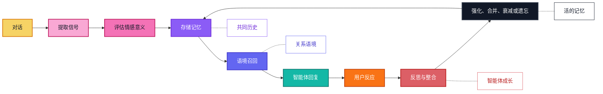

<p align="center">
  
</p>

<p align="center">
  <a href="../../README.md">English</a> |
  <a href="zh-CN.md">简体中文</a> |
  <a href="ja.md">日本語</a> |
  <a href="ru.md">Русский</a> |
  <a href="ko.md">한국어</a> |
  <a href="es.md">Español</a> |
  <a href="pt.md">Português</a>
</p>

<p align="center">
  <strong>帮助 AI 伙伴成长、适应，并长期记住真正重要之事的情感长期记忆。</strong>
</p>

<p align="center">
  <a href="#overview">概览</a>
  ·
  <a href="#quick-install">快速安装</a>
  ·
  <a href="#实现状态">实现状态</a>
  ·
  <a href="#features">功能</a>
  ·
  <a href="#agent-skills">Agent Skills</a>
  ·
  <a href="#why-zifamem">为什么</a>
  ·
  <a href="#how-it-evolves">演化机制</a>
  ·
  <a href="#use-cases">使用场景</a>
  ·
  <a href="#planned-features">路线图</a>
  ·
  <a href="#project-status">状态</a>
</p>

<p align="center">
  
  
  
  
</p>

> ZifaMem 现在提供 alpha 版 Python SDK。当前版本聚焦默认无外部依赖的情感记忆生命周期、可选 LLMProvider 抽取、本地 JSON 存储、prompt 上下文组装和单元测试；生产数据库与向量检索集成仍在规划中。

<a id="overview"></a>
## 概览

ZifaMem 是一个面向 AI 智能体、AI 伙伴以及关系型产品的情感长期记忆框架。

大多数记忆系统帮助智能体检索事实。ZifaMem 关注的是让智能体**成长**：随着关系变化，记忆可以被强化、削弱、合并、反思和遗忘。目标不是无限堆积聊天记录，而是构建一个活的记忆层，让 AI 伙伴随着时间变得更一致、更个人化，也更理解情感语境。

当前 alpha 版已经实现这个方向的基础层，完整的成长闭环仍在建设中。

## 实现状态

alpha SDK 已实现：

- [x] 通过 `record_turn` 记录 L1 会话缓冲
- [x] 通过 `end_session` 生成 L2 会话摘要
- [x] 带类别、重要性、强度、证据和情感信号的 L3 长期记忆记录
- [x] 从身份、偏好、边界、冲突、脆弱性和重要经历类记忆更新 L4 用户画像
- [x] 默认无依赖 heuristic 抽取，只从 memory-eligible 用户轮次提取
- [x] 可选 `LLMProvider` 抽取，包含 JSON 校验、用户证据过滤和 heuristic fallback
- [x] 通过 `get_context` 组装 prompt-ready 记忆上下文
- [x] 本地 `InMemoryStore` 和 `JsonMemoryStore`
- [x] 手动 `remember`、`reinforce`、`weaken`、`forget` API
- [x] 结合词面语义重叠、记忆强度、重要性、时间衰减和情感强度的召回排序
- [x] 面向集成和记忆安全审查的可迁移 Agent Skills

TODO：

- [ ] 自动合并和更新相关记忆，目前仅有保守的重复记忆处理
- [ ] 周期性修订或整合记忆的 reflection loop
- [ ] 关系时间线可视化和更完整的关系状态建模
- [ ] 生产数据库、向量存储和 hosted service 适配器
- [ ] 用户可见的记忆查看、修正、同意和删除 UI
- [ ] 显式结合用户状态、关系状态和对话意图的更强召回
- [ ] 从用户反馈学习并修正过期记忆的 agent growth loop
- [ ] 长周期记忆连续性评估工具

<a id="quick-install"></a>
## 快速安装

```bash
python -m pip install -e .
python -m zifamem demo
```

开发测试命令：

```bash
python -m pip install -e ".[dev]"
python -m pytest
```

默认引擎采用会话边界整合：当前轮次作为 L1，会话结束生成 L2 摘要，重要用户事实升级为 L3 情感长期记忆，并进一步更新 L4 用户画像。

### 可选 LLM 抽取

ZifaMem 默认不需要 LLM。如果希望用模型生成会话摘要和长期记忆候选，可以注入 provider：

```python
import os

from zifamem import LLMMemoryExtractor, OpenAICompatibleProvider, ZifaMemory

provider = OpenAICompatibleProvider(
    api_key=os.environ["OPENAI_API_KEY"],
    model="gpt-4.1-mini",
)

memory = ZifaMemory(extractor=LLMMemoryExtractor(provider))
```

`OpenAICompatibleProvider` 使用 Chat Completions JSON object 模式，也可以通过 `base_url` 指向本地或托管的兼容网关。LLM 抽取器会在写入长期记忆前校验类别、分数和用户事实证据；provider 失败时会回退到默认无依赖 heuristic 抽取器。

<a id="agent-skills"></a>
## Agent Skills

本仓库也发布面向 coding agent 和 agent harness 的可迁移 Agent Skills：

- `skills/zifamem-integrate`：把 ZifaMem 接入 AI 伙伴、聊天机器人、角色扮演智能体或 coding-agent harness。
- `skills/zifamem-memory-audit`：审查记忆流程中的抽取安全、用户事实证据、LLM 输出校验和公开发布泄漏风险。

这些 skill 使用可迁移的 `SKILL.md` 文件夹形态，可以复制到支持 Agent Skills 的工具中：

```bash
# Codex personal skills
mkdir -p ~/.codex/skills
cp -R skills/zifamem-* ~/.codex/skills/

# Claude Code personal skills
mkdir -p ~/.claude/skills
cp -R skills/zifamem-* ~/.claude/skills/
```

对于 OpenClaw 或其他兼容 `SKILL.md` 的运行时，请把同样的文件夹复制到对应工具配置的 skills 目录。这里的 skills 是公开安全的流程指导；真正的持久化记忆仍需要在应用运行时接入 ZifaMem SDK。

<a id="features"></a>
## 功能

- 为情绪、感受强度、信任、舒适感、冲突、依恋和边界等信号建模
- 面向长期用户-智能体连续性的关系记忆基础结构
- 支持强化、衰减感知召回和遗忘的记忆生命周期 API；自动合并和反思循环仍在规划中
- 结合词面语义相关性、时间、重要性、强度和情感强度的情感感知召回原型
- 面向智能体的抽取、存储、检索、会话整合和 prompt 上下文组装接口
- 可选 LLMProvider 接口和 OpenAI-compatible 抽取适配器
- 面向集成和记忆安全审查的可迁移 Agent Skills
- 面向开发、测试和小规模部署的内存存储与 JSON 存储
- 已提供记忆删除、削弱和强化 API；用户可见的记忆 review UI 仍在规划中

## ZifaMem 适合谁？

ZifaMem 适合正在构建 AI 产品的团队，尤其是那些希望智能体像是在学习一段关系，而不只是搜索数据库的产品。

如果你有以下需求，ZifaMem 会很适合：

- 构建 AI 伙伴、角色智能体、教练或情感支持智能体
- 希望记忆能随着信任建立、冲突修复或重复模式而变化
- 希望智能体更个人化，但不永久保存每一次对话
- 关注情感连续性、用户同意、用户控制和长期安全
- 需要能支撑反思和长期成长的记忆层

如果你只需要短期聊天历史、文档检索或任务型事实召回，ZifaMem 可能不是最合适的选择。

<a id="why-zifamem"></a>
## 为什么是 ZifaMem

大多数 AI 记忆系统面向事实召回：姓名、偏好、文档、任务和检索片段。

ZifaMem 面向另一层记忆：**情感连续性**。

对于 AI 伙伴和以关系为中心的产品，记忆不只需要保存发生了什么，还需要保存当时的感受、为什么重要，以及这段关系如何随时间演化。ZifaMem 面向那些需要记住信任、舒适、冲突、依恋、边界、修复、重复情绪模式和重要共同经历的系统。

## 不同之处

| 静态记忆 | ZifaMem |
| --- | --- |
| 存储事实和片段 | 建模具有情感意义的记忆 |
| 优化语义相似度 | 平衡相关性、时间、强度和关系语境 |
| 把记忆当作静态文本 | 让记忆可以增强、淡化、合并和遗忘 |
| 召回用户说过什么 | 召回什么真正重要，以及它如何影响关系 |
| 基于孤立偏好做个性化 | 基于持续演化的关系时间线做个性化 |
| 适合任务型智能体 | 为 AI 伙伴、角色扮演、教练和社交 AI 设计 |

## 什么时候应该使用 ZifaMem？

当瓶颈不再是基础检索，而是**连续性**时，可以考虑使用 ZifaMem：

- 需要跨会话记住情绪历史的长期智能体
- 信任、脆弱、舒适和冲突很重要的 AI 伙伴产品
- 需要稳定共同历史的角色扮演或角色智能体
- 需要识别重复情绪模式的教练和反思工具
- 需要同意、衰减、修正等记忆策略的社交 AI 系统
- 希望随着关系成熟而持续改进回复的智能体

<a id="how-it-evolves"></a>
## 它如何演化

ZifaMem 把记忆视为一个生命周期，而不是一堆保存下来的消息。



## 核心概念

### 情感记忆

记忆可以携带情绪、情感倾向、强度、舒适感、脆弱性、冲突、信任和依恋相关性等信号。

### 关系时间线

ZifaMem 围绕用户和 AI 系统之间持续演化的关系组织记忆，而不是只保存孤立的对话片段。

### 记忆生命周期

记忆可以被创建、强化、削弱、更新、合并或遗忘。目标是让记忆系统持续演化，而不是永久积累过期上下文。

### 智能体成长

智能体可以通过记忆反思，更贴近用户的情绪模式、关系历史和偏好的支持方式。

### 语境召回

召回会结合语义含义、情感相关性、时间、用户状态、关系状态和当前对话意图。

### 智能体原生设计

ZifaMem 计划作为面向智能体的框架，支持抽取、存储、检索、反思、个性化和情感感知回复生成。

<a id="use-cases"></a>
## 使用场景

- AI 伙伴
- 情感支持智能体
- 角色扮演和角色智能体
- 长期个人 AI 助理
- 教练和反思工具
- 社交 AI 产品
- 情感感知社区和客服智能体

<a id="planned-features"></a>
## 计划功能

- 生产数据库和向量存储适配器
- 自动记忆合并、更新和反思循环
- 更多 LLM 反思与 provider 示例
- 关系时间线可视化
- 更完整的情感感知检索排序
- 强化有用记忆、修正过期记忆的智能体成长循环
- 用户可控的记忆可见性
- 基于同意的记忆编辑和删除
- 更多面向 AI 伙伴的 SDK 示例
- 记忆连续性评估工具

## 常见问题

### ZifaMem 是向量数据库吗？

不是。ZifaMem 计划作为一个可以与存储和检索系统配合的记忆框架，但重点是情感意义、生命周期策略、关系连续性和智能体成长。

### ZifaMem 会保存每一次对话吗？

不会。目标是抽取有意义的记忆，并让它们随时间变化。有些记忆应该被强化，有些应该被修正，有些应该淡化或遗忘。

### 它和普通个性化有什么不同？

普通个性化通常保存偏好。ZifaMem 面向关系型语境：信任、舒适、冲突、脆弱、依恋、边界、修复和共同历史。

### 用户可以控制记忆吗？

用户可见的记忆查看、修正、删除和基于同意的控制在计划路线图中。

<a id="project-status"></a>
## 项目状态

ZifaMem 处于早期开发阶段。

这个公开仓库已经包含首版 Python SDK、可选 LLM 抽取适配器、示例和单元测试。当前实现默认仍优先本地运行且无外部依赖，适合评估、原型和适配器开发；生产存储、向量检索、托管服务和最终许可证仍在准备中。

## 关注项目

Watch 本仓库以跟进开源发布。

组织动态请访问 [Zifa AI](https://github.com/zifacorp)。

## 许可证

将随源码发布一同公布。
